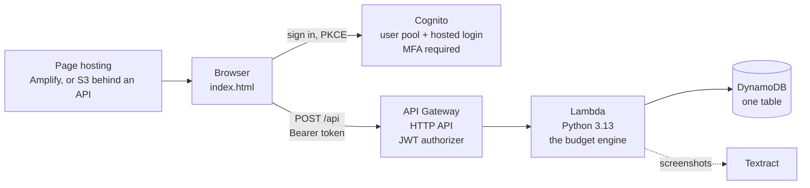

# The AWS build

A single-page app, an HTTP API behind a login, one Lambda and one table. Nothing
runs while nobody is using it, so it idles at $0.00.



| Piece | Service | Notes |
| --- | --- | --- |
| Login | Cognito user pool | hosted login, authorization-code grant with PKCE, no client secret, self-registration off, TOTP required |
| Front door | API Gateway HTTP API | one route, `POST /api`, refused without a valid token before anything runs |
| Logic | Lambda | `src/handler.py` hands the request to `budget.api.dispatch`; standard library only |
| Data | DynamoDB | on-demand; an item per month, per answer, per setting |
| Files | S3 | a data bucket, and a web bucket for the page |
| The page | `web/index.html` | one file, no build step, no framework |

## What is in this folder

- **`src/`** — the Lambda: `handler.py` and the engine, `budget/`. The
  household's rules are data, in `src/budget/rules.toml`.
- **`web/`** — the page and the rendered user guide. `config.example.js` shows
  the three values a deployed copy needs.
- **`infra/`** — the same system as Terraform: modules for storage, compute,
  auth, api and frontend, composed in `envs/dev`.
- **`docs/`** — the user guide, the architecture notes, the runbooks for two
  ways of hosting the page, and the list of every resource with its teardown.
- **`scripts/`** — `build.py` makes the Lambda zip, byte-identical for identical
  sources; `manual.py` renders the guide.
- **`examples/`** — three invented months to paste in.
- **`tests/`** — see below.

## Two ways it was built

**By hand first.** Every resource was created in the console, one at a time,
and each was written down the moment it existed, with the clicks that remove it:
[docs/RESOURCES.md](docs/RESOURCES.md). The rule of
that file is that if it is not written there, it was not done.

**Then as code.** `infra/` builds a second, independent instance with one
`terraform apply`. The modules are small and say why as well as what; the
comments are worth reading.

### The piece that would not build

The page was meant to be served by CloudFront from a private bucket, and the
Terraform describes exactly that. On a new account, CloudFront refused: the
account had to be verified before it could add a distribution, and the console
refused identically. So `var.frontend_url` exists: set it and the distribution
and its bucket policy are skipped, and the login and the API are pointed at
wherever the page is actually served. Everything else — 25 of 27 resources —
builds and works.

Two ways round it were then built by hand, both written up as runbooks:

- [Amplify Hosting](docs/runbooks/amplify-hosting.md) — a zip upload. It runs on
  CloudFront underneath and was nevertheless allowed.
- [A REST API as an S3 proxy](docs/runbooks/rest-api-s3-proxy.md) — a private
  bucket read through an IAM role by an AWS service integration, with path and
  header mapping. Built for the practice, tested, and torn down again.

## Deploying it yourself

1. Create a bucket for the Terraform state and name it in
   `infra/envs/dev/backend.tf`, where a placeholder stands now.
2. `cd infra/envs/dev && terraform init && terraform plan -out=tfplan`, read the
   plan, then `terraform apply tfplan`.
3. Copy `web/config.example.js` to `web/config.js` with the values
   `terraform output` prints.

`infra/README.md` and the comments in each module explain the choices.

## Tests

```
python -m pytest
```

- `test_months.py`, `test_rulings.py`, `test_setup.py`, `test_backup.py` — the
  engine on the invented household: reading a month, the person's decisions
  outranking the rules, shaping groups and limits, closed months, and a restore
  that puts back exactly what was saved. The figures were worked out by hand
  from `examples/month-1.txt` before the engine was asked.
- `test_dynamo.py` — the DynamoDB store against a fake table.
- `test_browser.py` and `browser_*.js` — the real page driven in a headless
  browser, with the server stubbed: every editor, the three-step restore, the
  questions, moving a figure, switching views while one is still loading.
- `test_manual.py` — the guide page is what the guide's source renders to.
