# Budget tracker — the guide

For someone who has just opened this for the first time and has never set up
groups or limits before. It assumes nothing except that you write down what you
spend.

You do not have to read it in order. If you only want to get going, read
**The idea** and **Writing a day**, add a month, and come back when a word on
the screen stops making sense.

- [The idea](#the-idea)
- [The first thing you see](#the-first-thing-you-see)
- [Your account](#your-account) — one login, and how to get back in
- [Writing a day](#writing-a-day) — the only format you have to learn
- [Adding a month](#adding-a-month)
- [Questions](#questions) — why it asks, and how to teach it a word
- [Reading the month](#reading-the-month)
- [Groups](#groups) — **the one idea worth understanding**
- [Tiers, and the two Totals](#tiers-and-the-two-totals)
- [Limits](#limits)
- [Setting up your own, from scratch](#setting-up-your-own-from-scratch)
- [The Left line](#the-left-line)
- [Correcting a figure](#correcting-a-figure)
- [Comparing months, and printing](#comparing-months-and-printing)
- [Backups](#backups)
- [The gear menu](#the-gear-menu) — and the [language](#language)
- [When something looks wrong](#when-something-looks-wrong)

---

## The idea

Most budget apps ask you to categorise a purchase at the moment you make it.
This one does not. You keep writing notes the way you already do — a date, a
list of amounts, a word or two each — and paste them in when it suits you. The
app reads them, sorts them into groups, adds them up, and asks you about the
handful of lines it could not place confidently.

So the loop is:

```
    write notes on your phone  →  paste them in  →  answer a few questions
                               →  read the month
```

Nothing leaves your computer. There is no account anywhere, no sync, no server
but the one running in your own machine while the window is open.

**Amounts are shown in thousands.** A bar reading `15.9` means 15,900 of
whatever currency you write in. The app never converts anything; it only adds up
the numbers you wrote.

---

## The first thing you see

Before you have added anything, the app shows the month as it will look, only
empty: the major groups as bars at the top, the limits in their own box beside
them, the Totals, the minor groups below, and the Left line last - every group
in its place, at nought.

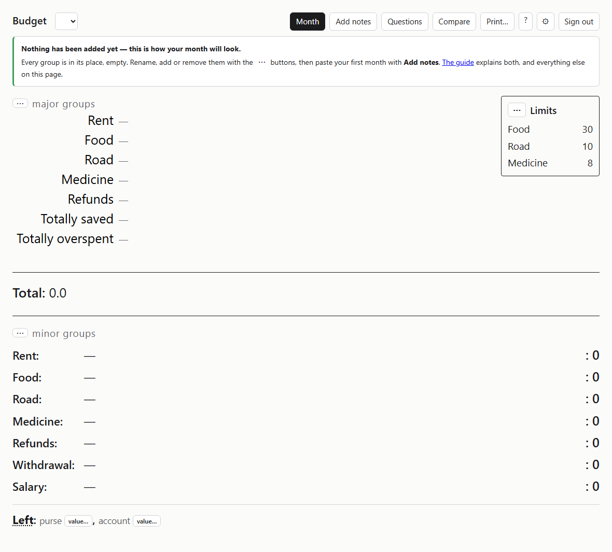

**There are only a few, on purpose.** Four to spend from: **Rent**, which
carries what you pay for the roof and nothing else, and **Food**, **Road** and
**Medicine**, with monthly limits of 30, 10 and 8 thousand. Below them is
**Refunds**, where money coming back lands.

They are a starting point, not a verdict. The **⋯** buttons, each beside the
part it edits, are live now: rename the groups into your own, add what is
missing and remove what you do not need, before you paste a single note — the
order most people will want. With nothing added yet, no change asks which months
it is for; there are no months to ask about. Or go straight to **Add notes** and
start with a month; the same page fills in the moment there is one.

You will see this page again if you ever use *Start over* to wipe everything.

---

## Your account

The first time you open the app it asks you to create the one account it holds.
There is exactly one, and once it exists this page never appears again.

The page also offers **English · Русский**: set up from the Russian page and the
app starts in Russian, with the same groups named in Russian — see
[Language](#language).

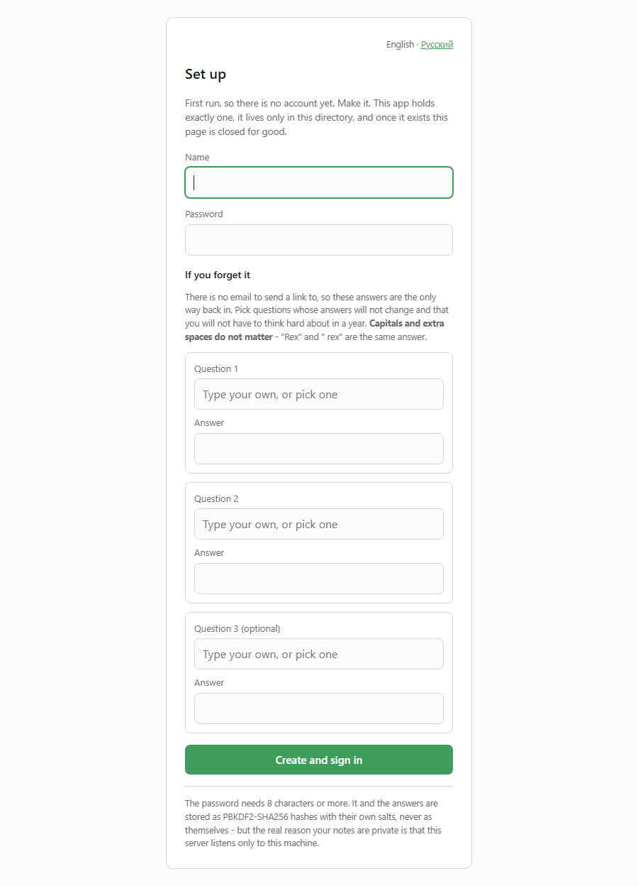

Along with a name and password it asks for **recovery questions**. Do not skip
past them, because they are the only way back in. There is no email address to
send a new password to and nobody to ask — the app runs entirely on your
computer and knows nothing about you.

Two questions are required and a third is offered. Some advice on choosing them:

- **Pick answers that cannot change.** Your first pet is settled forever. Your
  favourite restaurant is not.
- **Pick answers you will not have to reconstruct.** If you have to work out
  what you would have said, you will get it wrong in two years.
- **A word or number only you would think of is a perfectly good "question".**
  It is the last suggestion in the list for that reason.
- **Capitals and extra spaces do not matter.** `Rex`, `rex` and `  REX ` are all
  the same answer. Nothing else is ignored, so punctuation does count.

### Getting back in

The sign-in page has a **Forgotten your password?** link.

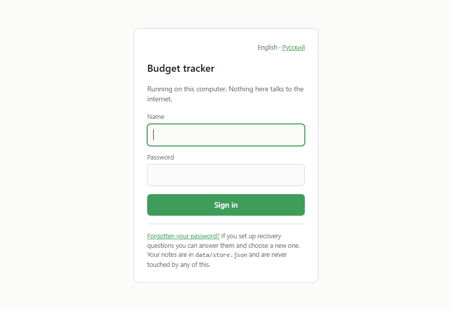

It asks your questions and, if every answer is right, lets you choose a new
password and signs you straight in.

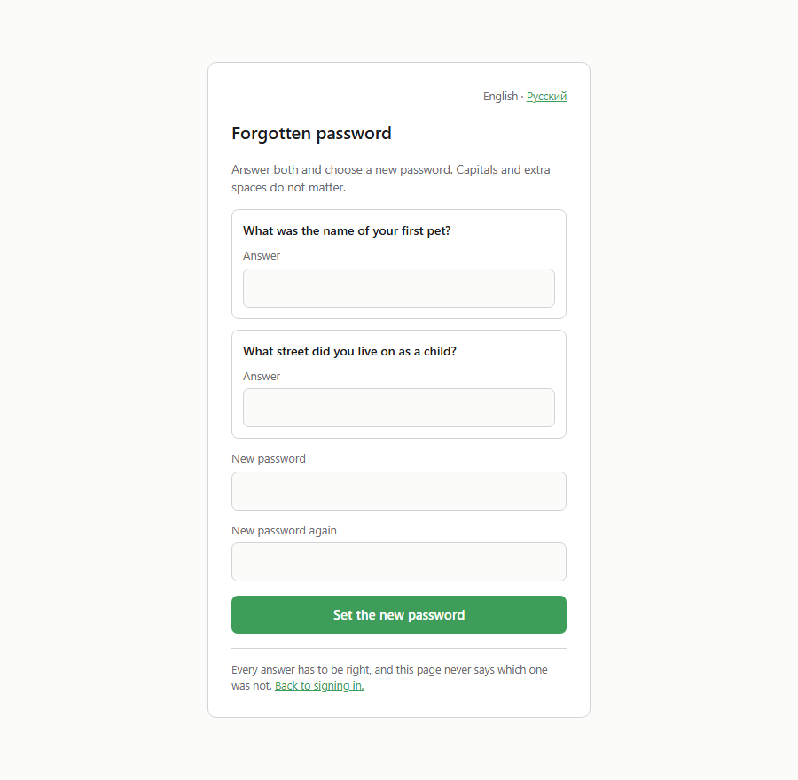

Some things worth knowing before you need them:

- **Every answer has to be right**, and the page never says which one was wrong.
  Saying so would let someone work through the questions one at a time.
- **Five wrong sets and it stops asking for a quarter of an hour.** A pet's name
  is guessable in a way a password is not, so the tries are counted. Only the
  questions are locked; if you remember the password itself you can still sign
  in normally.
- **Your notes are never involved.** They live in `data/store.json`; the login
  lives in `data/users.json`. Nothing about passwords touches the first file.

### Changing your questions

Open **http://127.0.0.1:8765/security** while signed in.

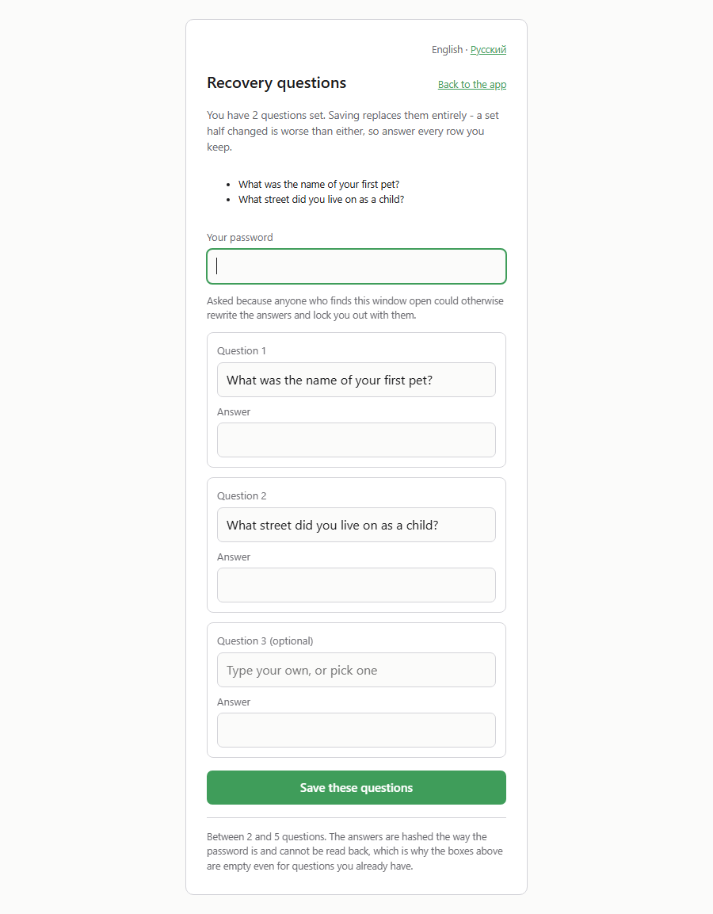

It asks for your password first, because otherwise anyone who found the window
open could quietly replace the answers with ones they knew. Saving replaces the
whole set rather than editing it, so answer every row you want to keep.

The answer boxes are empty even for questions you already have. They have to be:
the answers are stored the same way the password is, as a hash that cannot be
turned back into the words you typed.

### If there is no way in at all

Delete `data/users.json`. The app will ask you to set up again exactly as it did
on the first run. **That loses the login and nothing else** — your notes are in
`data/store.json`, which is a different file and is not touched.

This is worth knowing for its own sake: it means the password is a lock against
whoever else sits down at your computer, not a vault. Anyone who can delete a
file can already get in. The recovery questions are a convenience, and they take
nothing away that was being protected.

---

## Writing a day

This is the only format you have to learn, and it is deliberately close to how
people already scribble.

```
10.01
+ 57 300
9400 rent card
+ 210 do not count, refers to December
Left: purse 6.8, account 61240

11.01
26 bus
2340 grocer
135 eggs and cheese
26 bus
Left: purse 4.3, account 61240
```

Those are the first two days of the example January, one of three invented
months that come with the app — see [The example months](#the-example-months).

Line by line:

| What you write | What it means |
| --- | --- |
| `11.01` | a date, `dd.mm`. It starts a new day. |
| `2340 grocer` | an amount, then what it was. The words decide the group. |
| `9400 rent card` | the word `card` says it was paid by card, not in cash. |
| `26 bus` | a fare. `bus`, `taxi`, `train`, `ticket` and `fuel` are words the app already reads as Road — see below. |
| `+ 57 300` | a **plus** makes it money coming in, not going out. |
| `+ 210 do not count, refers to December` | money that belongs to another month: it is counted in December, never here. `do not count, previous month` sends it to the month before. |
| `Left: …` | optional. What you have left at the end of the day, in an order you decide. See [The Left line](#the-left-line). |
| a blank line | a break between separate outings in the same day. **This matters.** |
| `######` | three or more `#` alone on a line: the month ends here, and the next one starts with its salary. See below. |

Four things worth knowing early:

**A month starts with your salary and ends with a line of `#`.** The first line
of a month's notes is the income that opens it: `+ 57 300` in the example. When
the month is over, write three or more `#` on a line of their own after its last
day, before the next salary:

```
27.01
26 bus
310 fruit
26 bus
Left: purse 1, account 32500

######

10.02
+ 58 650
```

If you keep all your months in one running note and paste the lot, these lines
are how the app tells the months apart. Without one, the next month's days are
read as more of the month before. If you paste each month on its own, you can
leave the line out. It has nothing to do with a month being *closed*: the app
locks a month by itself, three months after it ends (see
[Correcting a figure](#correcting-a-figure)).

**Spaces in numbers are fine.** `57 300` and `57300` are the same, and so are
`9 500 atm` and `9500 atm`. Write them however you write them.

**A blank line separates outings.** If you go to the cinema in the afternoon and
to the grocer's in the evening, put a blank line between them. The app uses
those breaks to decide which fare belongs to which outing — without them, the
fares to the cinema are read as a trip to the shops.

**Say what a fare was, if you can be bothered.** `26 bus` is a Road line
wherever it stands. A fare written bare — `26` and nothing else — goes with the
outing it sits in instead: on either side of `740 cinema` in a block of its own,
the app asks whether to start a group for that outing and charge its fares to
it; on a trip to the grocer's it is Road. Anywhere else nothing on the line says
where you went, and the app has to ask.

### Money coming back

Put a `+` in front. A refund, a reimbursement, a repayment.

```
+ 1200 refund
```

That line of the example January says what it is, and lands in Refunds, which
is taken off the month's Total. A bare `+` written straight under the purchase
it returns, for about the same amount, goes back where that purchase went:

```
620 cough syrup
+ 620
```

The refund lands in Medicine beside the syrup, and the two cancel out, so a
refunded purchase nets out to nothing rather than being counted twice.

### Money that belongs to another month

End a line with *do not count, refers to* and a month when the money is that
month's rather than this one's — a refund for something bought in December that
arrives in January, say:

```
+ 1800 ladder, do not count refers to December
```

The line is December's, not January's, **whether or not December is in the app
yet**. January counts it nowhere and does not show it. With December in the
app, the line joins December's last day. Without, the app makes a December for
it: December appears in the month list holding that one line, dated the month's
last day, and says it is made of lines from other months. There the line is
read like any line of December — placed by the rules, or asked about in
December's Questions, where a group the line names is offered first. When you
add December's own notes — as a new month, or with Add to December — they join
that line, and an answer you gave it stays. *do not count, previous month*
does the same for the month before.

---

## Adding a month

**Add notes**, paste, **Add**.

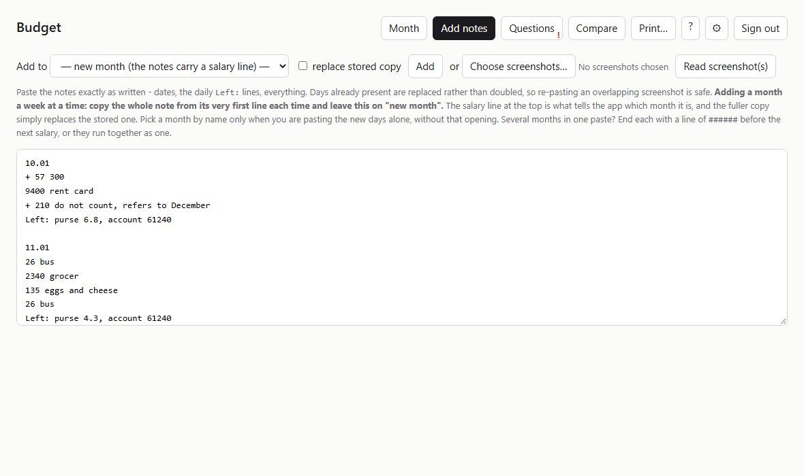

Two things on that screen are worth understanding.

**"— new month —" versus picking a month by name.** The app works out which
month a paste belongs to from the income line that opens it — the salary, or
whatever regularly starts your month. If your paste has that opening line, leave
the box on "new month" and it sorts itself out. Pick a month by name only when
you are pasting a few extra days on their own, with no opening line to identify
them.

**Re-pasting is safe.** If a day is already stored, the fuller copy replaces the
shorter one. It is never doubled. So the easy habit is: each time you want to
catch up, copy the whole note from its very first line and paste the lot. If
that note holds several months, each must end with its `######` line (see
[Writing a day](#writing-a-day)).

### The example months

Three invented months come with the app, in the `examples` folder beside it: the
January, February and March this guide quotes, written for the groups the app
starts with. To watch the app at work before writing anything yourself, open
one, copy everything in it and paste it into **Add notes**. They take the
current year, and the app locks a month three months after it ends: if an
example month shows as locked, use *Unlock this month* at the top of it before
answering or moving anything.

When you are ready for your own notes, clear them away — see
[Setting up your own](#1-clear-the-example-months-if-you-pasted-them).

### From a screenshot

If your notes live in a phone app, photograph them, then click **Choose screenshots…**
and **Read screenshot(s)** instead of typing. The text lands in the box for you to check before it is added
— always check it, because OCR misreads digits occasionally and this is money.

This needs the OCR engine to be installed; see [README.md](README.md). Everything
else works without it.

---

## Questions

The app never silently guesses. When a line could reasonably belong to two
groups, or to none it knows, it asks — and until you answer, its figure is
provisional: a line it cannot place at all is counted nowhere, and one with a
likely home is counted there for now.

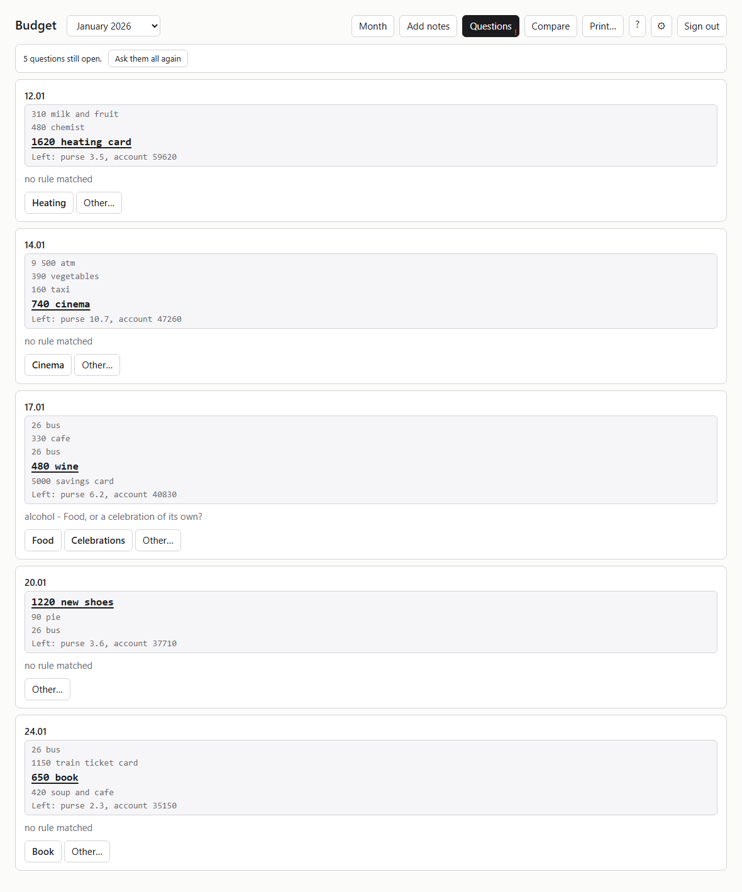

Each question shows the day its line was written on: the date, then that day's
lines exactly as you wrote them — the blank lines, the credits and the Left line
too — with the one asked about in bold, in a box that opens on it and scrolls
through the rest of the day. It says what the doubt is,
and offers the answers it thinks likely. The buttons are shortcuts, not a menu:
**Other…** lets you type any group name, and if you type a name that does not
exist yet, it offers to start a new group with it. A name one letter off a
group that exists — *Theater* where there is a *Theatre* — first asks
*Did you mean Theatre?*: yes books the line there, no starts the new group.

That screenshot is the example January, with five questions of two kinds:

- **`1620 heating card` — "no rule matched".** Nothing in the line matches a
  group the app knows. It has picked the word that looks most like a name and
  offers it as a new group, which is one click rather than typing. `740 cinema`
  and `650 book` ask the same; `1220 new shoes` has no word to offer, so its
  group is typed with **Other…**.
- **`480 wine` — "alcohol - Food, or a celebration of its own?"** The line
  genuinely reads both ways, and which one you mean changes the month. Until you
  answer, it is counted in Food.

The example February asks about its heating again, a haircut and a new lamp;
March about its heating, an umbrella and socks, and headphones.

There are three more kinds you will meet, and they are worth knowing:

- **A group you removed.** Its lines come back here, each asking
  *"the group Food was removed - where does this go?"*, and each is counted
  nowhere until you answer. See [Removing a group](#removing-a-group).
- **A line that names two groups.** `450 pie and pills` is food and medicine at
  once, so the app does not choose: it asks
  *"this line names Medicine and Food - which was it?"*, with both on the
  buttons.
- **A word hiding inside another word.** The app books `grocer` to Food — and
  `grocer` also sits inside `greengrocer`, a different word that the rule was
  never written for. When a rule only matches in the middle of a longer word,
  the app will not book it on that alone. It asks
  *"greengrocer is not grocer - which group is this?"* and offers `Greengrocer`
  first, as a group of its own, with `Food` beside it.

**Your answers are remembered per month and per occurrence.** Answering
*wine → Celebrations* in January does not silently decide the next wine, in
February or later; the same words can mean different things in different months.

**"Ask them all again"** forgets this month's answers and puts every question
back. The figures return to what the rules alone make of the notes. Useful when
you have changed your mind about how a month should be read.

### Teaching it a word

A question you answer settles that one line, in that one month. The heating
card is asked about in January, again in February and again in March — because
which words belong to which group is something the app only knows from the few
words it starts with, and your shops are not those.

So you can teach it. **Gear → Words you teach…** takes a word and the group it
belongs to. From then on, any line carrying that word books straight there,
and is not asked about.

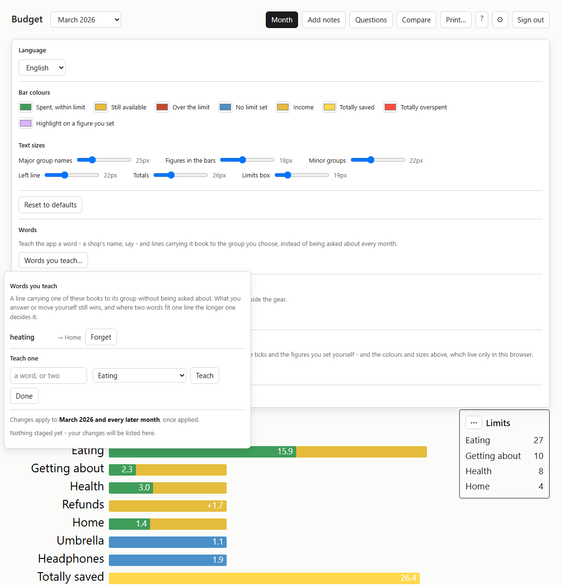

A word is taught for a minor group that already exists, and the heating has none
yet. So make one first: a major group Home, with a minor group Home under it
(see [Groups](#groups)). Then teach `heating` for Home, and the heating cards
book there, in every month the word is taught for.

A few things worth knowing:

- **It asks which months first**, once there are months, the same as the group
  editors do: this month and every later one, or every month, the earlier ones
  too. Teaching a word from this month on leaves the months you have already
  read and printed exactly as they are.
- **What you answer or move by hand still wins.** A taught word is about every
  line carrying it; an answer is about one line, and the particular beats the
  general.
- **Two words fitting one line: the longer one decides.** Teach `ticket` for a
  group *Outings* of your own and `train ticket` for *Road*, and
  `1150 train ticket card` takes the second.
- **A word, not a fragment.** `heating` does not match inside `preheating`, and
  you can teach two words together — `corner shop` — which then match with
  any spacing between them.
- **Forget takes one back**, and the lines that carried it go back to being
  read by the rules, or asked about.

Words travel in a backup with everything else, so a copy restored elsewhere
knows what you taught.

---

## Reading the month

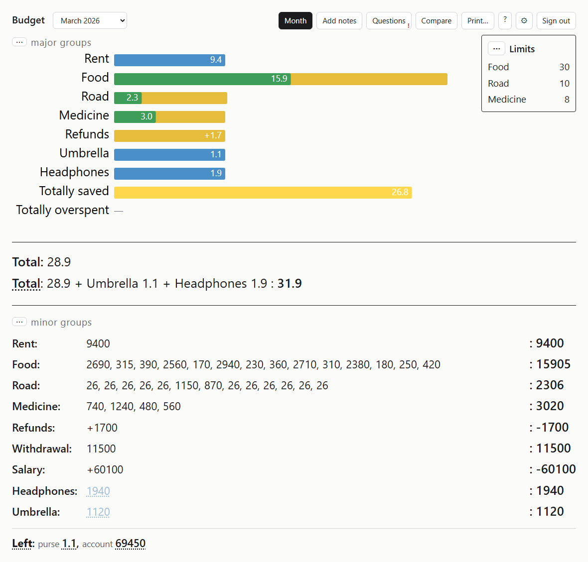

Four things are on this page.

**The bars** are your major groups, one per row, in the same order every month
so the page always looks the same. A group that had no spending shows a dash
rather than vanishing — its absence is information too.

- **Green** is what you spent.
- **Yellow** beside the green is the room left under that group's limit.
- **Red** means you went past the limit, and the red section is the overspend.
- **Blue** means the group has no limit at all.
- The two bottom rows, **Totally saved** and **Totally overspent**, add up all
  the yellow and all the red. They are readings, not groups.

**The limits box** on the right is your monthly plan, in the order you choose.

**The two Totals** are explained in the next section.

**The minor group list** below them shows every individual amount, so you can
see what any figure is made of. That is the list's whole job: not a sample of
what you spent but **all of it, gathered by group**. The month above is the
example March, with two of its three questions answered: `Food` is one bar
reading 15.9, and underneath it the `Food` line of the list carries all fourteen
of its purchases, cash and card alike, and totals them at 15,905.

The whole page, so you can see how the four parts sit together:

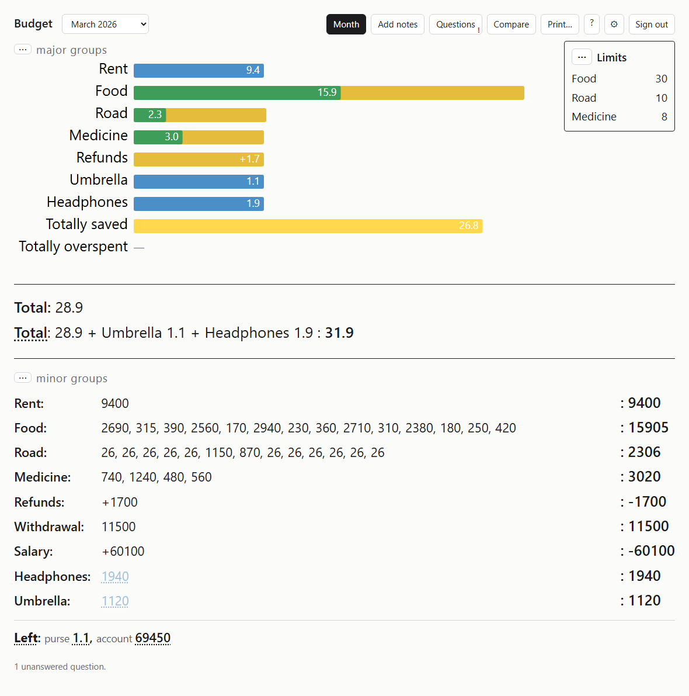

---

## Groups

This is the one idea worth understanding properly. Everything else follows from
it.

There are **two levels**.

A **minor group** is where a single line lands. `2340 grocer` lands in a minor
group; `26 bus` lands in a different one.

A **major group** is what several minor groups roll up into. Majors are what you
see on the chart, what limits watch, and what the Totals are made of.

The groups the app starts with have one minor under each major, named the same.
Here is Road in the example January, once a minor group Taxi has been added
under it and the word `taxi` taught for it:

```
    Road                ← major: one bar, one limit, one number (2.4)
      Road      2260    ← minor: the buses, the fuel, the train
      Taxi       160    ← minor: 160
```

**Why bother with two levels?** Because you want two different things at once.
You want *one* number for getting about when you look at the month, and you
want to keep the taxis and the buses apart when you look closer. One level
would force you to choose. So: minors keep the detail, the major adds them up.

You do not have to use both levels. A major group with a single minor under it
is perfectly normal — every one the app starts with is.

**Rent is the one group unlike the others.** It carries the rent your notes
record — `9400 rent card` in the example months — and nothing else, and it
keeps that figure until a new payment is written. Keep it for the rent alone:
anything else put in it would be replaced by that figure.

### Where the editors are

There is one **⋯** button beside each thing it edits, and clicking the word
**Left** on the closing line opens the fourth:

| Button | Where it is | What it edits |
| --- | --- | --- |
| **⋯** | above the chart, by "major groups" | major groups |
| **⋯** | inside the Limits box, before the word | limits |
| **⋯** | over the minor list, at the left with the other two | minor groups |
| **Left** | the closing line at the foot of the month | the Left line |

Before there is a month, the three **⋯** sit side by side above the groups. Once
there are months, each but the limits' asks *which months should this apply to*
before it opens, which is explained under
[Setting up your own](#8-changing-the-groups-once-there-are-months).

#### Minor groups

Every one shows the major it lives under. **route to…** moves it somewhere
else — this is how you reshape things: decide the taxis are an outing rather
than a way of getting about, and route `Taxi` under a major of your own
instead. The months the change is for recompute at once. **Remove** takes it
away, and the lines it held go to Questions.

Several minors may share one major, which is exactly how a dozen scattered lines
become a single figure. **Add** asks for a name and which major it belongs under,
and refuses without both.

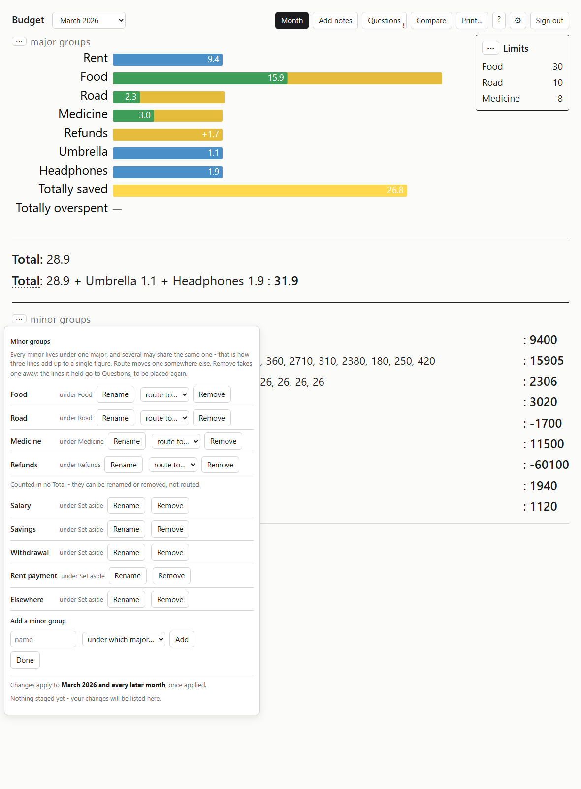

#### Major groups

**Rename** and **Remove**, and an **Add** that asks for a name, a
[tier](#tiers-and-the-two-totals) and — if you want one now — a limit.
**Remove** takes a major away with its minor groups; one group spending can go
to always stays. **Rename** also renames the minor that shares the major's
name — `Food` inside `Food` — and a minor may take its own major's name, but no
other group's. A major you add starts with no minor group under it: add one
before you teach it a word, or answer a question with its name, which puts the
line there.

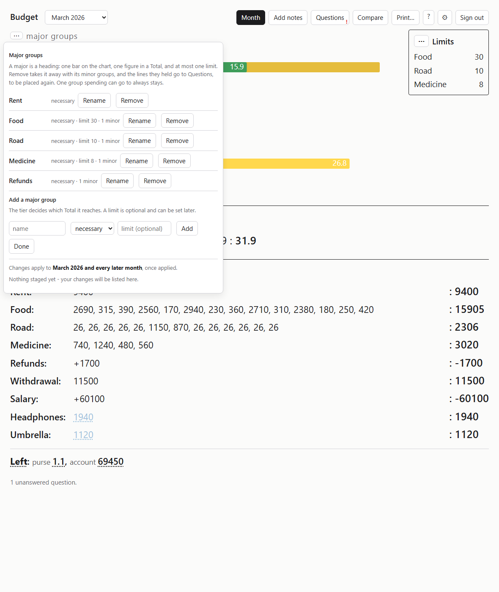

**Names are labels, and permanent identities are underneath.** This is why you
can rename a group and every old month, every stored answer and every rule
still works. Only the word on screen changes.

### Removing a group

Any group can go, at any time, but the last one spending can go to — a minor
group on its own, or a major with the minor groups under it. Nothing it counted
is lost. Every line it held comes back to Questions, asking
*"the group Food was removed - where does this go?"*, and is counted nowhere
until you answer. Before your first month there are no lines, so a group simply
goes.

Remove a minor group and its major stays, as a bar with nothing in it and its
limit still on; remove the major too once you no longer want the bar. A limit
holds no lines at all, so removing one asks nothing.

The groups set aside — Salary, Savings, Withdrawal, Rent payment, Elsewhere —
are in the minor groups' editor too, below the others, to rename or remove like
any other; they are never routed under another major, since a line sent there
would stop counting. Salary asks first: it holds your salary line, which then
goes to Questions and is counted wherever you answer it.

### The groups it comes with are only a starting point

The app starts with a working set of groups so the first month you paste has
somewhere to go: the rent, three broad groups nearly everyone spends on, and
limits sized for the example months. Every figure in those months, and in this
guide's pictures, is invented. **None of it is meant to be yours.** See
[Setting up your own](#setting-up-your-own-from-scratch).

---

## Tiers, and the two Totals

Every major group has a **tier**, and the tier decides how it reaches the
month's total. There are four.

| Tier | What it means | Where it lands |
| --- | --- | --- |
| **necessary** | the ordinary running of your life | the **first Total** |
| **frequent** | real spending, but not every month | added *after* the first Total |
| **occasional** | one-offs — a trip, a repair, a gift | added *after* the first Total |
| **excluded** | recorded, but counted in nothing | neither Total |

That is where the two Totals on the month page come from. The example March,
its umbrella and its headphones answered as groups of their own, reads:

```
    Total: 28.9                                       ← "necessary" only
    Total: 28.9 + Umbrella 1.1 + Headphones 1.9 : 31.9
```

**Why two?** Because "what does my life cost to run?" and "what did I actually
spend?" are different questions, and mixing them makes both useless. A month
with new headphones in it is not evidence that your groceries got more
expensive. The first Total is the comparable one, month to month. The second is
the truth about your bank balance.

**What "excluded" is for.** Some lines have to be written down but must not be
counted. Cash taken out of a machine is the clearest case: if the withdrawal
counted, and then the shopping you did with that cash also counted, you would
have spent it twice. Money moved to savings is the same — recorded, not spent.
The app starts with one such group, **Set aside**: the salary, savings, cash
withdrawn and the rent payment itself (Rent carries the rent). Money that
belongs to another month is not in it: that month counts it (see
[Money that belongs to another month](#money-that-belongs-to-another-month)).

### Choosing what the second Total counts

Click the word **Total** on the second line.

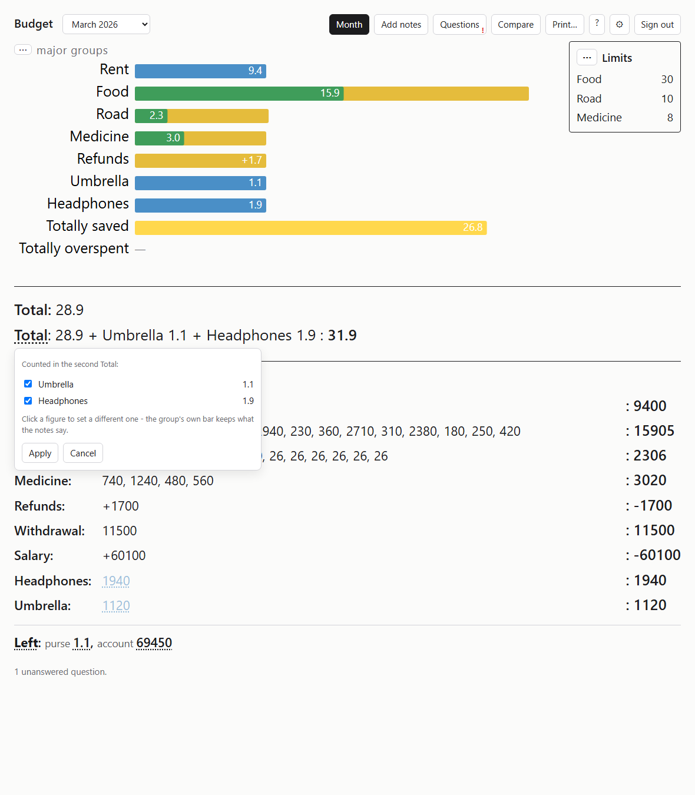

Every one-off group appears with a tick. Untick one and it drops out of that
Total — it keeps its bar and its detail, because it still happened, but it stops
colouring the month. Click the figure itself to enter a different one, for the
times when what you spent and what you want the month to carry are not the same.
A figure you set is marked, so you can never mistake it for a counted one.

---

## Limits

A limit is a monthly number you set for one major group. It changes nothing
about how spending is counted — it only draws the yellow and the red, and feeds
the two summary rows.

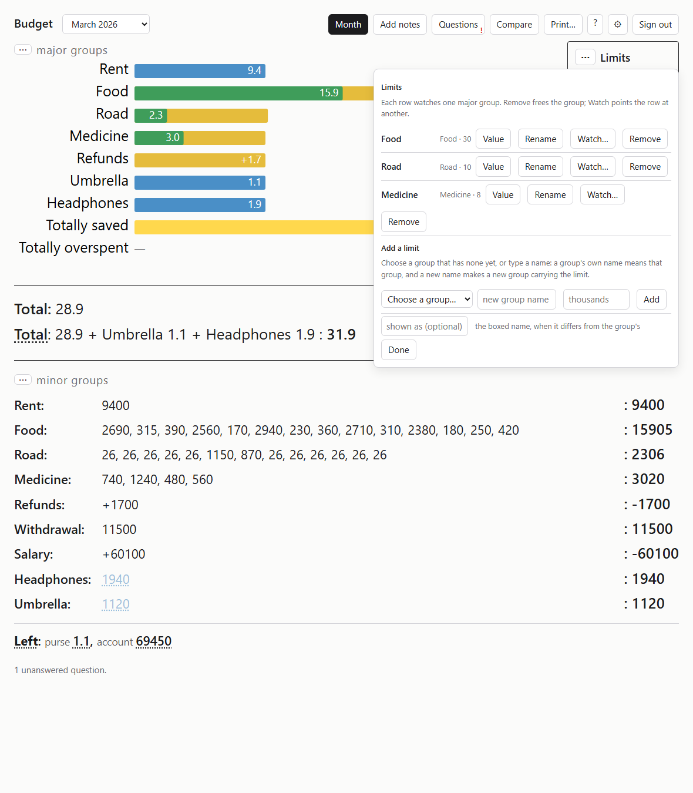

Each row watches one major group.

- **Value** sets the number, in thousands. `30` means 30,000.
- **Rename** changes what the box calls it, without renaming the group. Useful
  when the group is called `Food` but you think of that budget as "Groceries".
- **Watch…** points the row at a different group.
- **Remove** takes the limit off, and the group's bar turns blue.

**Add a limit** starts on *Choose a group…* and never picks one for you. Choose
the group, or type its name: a name that is already a group's puts the limit on
that group, and a new name makes a new group carrying the limit. *Shown as* only
names the row in the box; it chooses no group.

**A limit never asks which months.** It moves no figure a month counts, only
what the month is measured against, so the editor opens at once and every change
in it holds for every month. Any limit can go at any time.

The order of the rows is the order you set them in, and it is meant to be the
order you naturally read.

**Limits are optional.** A group with no limit still works perfectly; you just
lose the yellow-and-red reading for it.

---

## Setting up your own, from scratch

Here is a way to get from the groups the app starts with to your own life in
about ten minutes. The point of doing it in this order is that nothing asks and
nothing is counted again: you reshape the groups first, and only then start
adding months.

### 1. Clear the example months, if you pasted them

If you tried the app with the example months, clear them away before your own:
pick January, the earliest of them, open the gear (**⚙**) and under
**Start over** choose *January 2026 and every later month*. That keeps any
changes you have made to the groups. *Everything - months, answers, groups and
limits, from scratch* puts the groups back as the app started, too. Neither can
be undone.

### 2. Decide your majors first

Write down, on paper, the headings you want to see when you look at a month —
the things you think of as your regular monthly spending. Most people's list
looks something like:

```
    Rent        Eating      Getting about   Health
    Home        Going out   Garments        Hobbies
```

**There is no right number, and the app is not the thing limiting you.** It will
hold 200 majors and 500 minors, which nobody will approach. The reason to keep
the list short is that every extra group is another decision you have to make
about every line you write, forever. You can always add one later — and the app
will offer to, the first time a line does not fit anywhere.

### 3. Make the groups your own

Rename Food, Road and Medicine to the headings on your paper, remove the ones
you have no use for, and add the rest, in the **⋯** editors (see
[Groups](#groups)). Keep Rent if you pay one; remove it if you do not. Before
your first month nothing asks which months, and nothing can be lost: there are
no lines yet for a removed group to give back.

### 4. Set their tiers

Ask of each group you add: *does this happen every month, as part of the
ordinary running of things?* If yes, it is **necessary**. If it is real but
sporadic — new shoes, parcels, comics — make it **frequent**. Leave
**occasional** alone; the app creates those for you when a one-off turns up.

### 5. Add minors only where you want the detail

Under `Getting about` you might want the taxis apart from the buses, as the
Taxi example under [Groups](#groups) has them. Under `Home` you probably want
one per bill: `Heating`, say, and one for each of the others. Under `Garments`
you probably want nothing at all.

The test: *would I ever want to see these separately?* If not, do not split it.

### 6. Put limits on the ones you want to watch

Only the groups where a number would actually change your behaviour. A limit on
a group you cannot control is just a red bar telling you something you knew.
Limits can be added, changed and removed at any time, and none of it asks
anything.

### 7. Now paste your first month

And answer the questions. Any line whose words the app does not know becomes a
question, and an answer settles that line in that month alone. When the same
shop keeps coming back, teach the app its word once - see
[Teaching it a word](#teaching-it-a-word) - and it stops asking.

**A group's name is not a word.** Calling a group `Road` does not teach the app
the word *road*: a line reaches a group through the rules, a word you teach, or
your answer. Upper or lower case never matters - once *road* is taught, `ROAD`
and `Road` book there too. A question about a line that names a group does
offer that group first - `260 road` offers Road - but it is still a question:
only your answer books the line.

### 8. Changing the groups once there are months

Once there are months, whichever editor you open — the limits' aside — asks
which months your change applies to, before it opens.

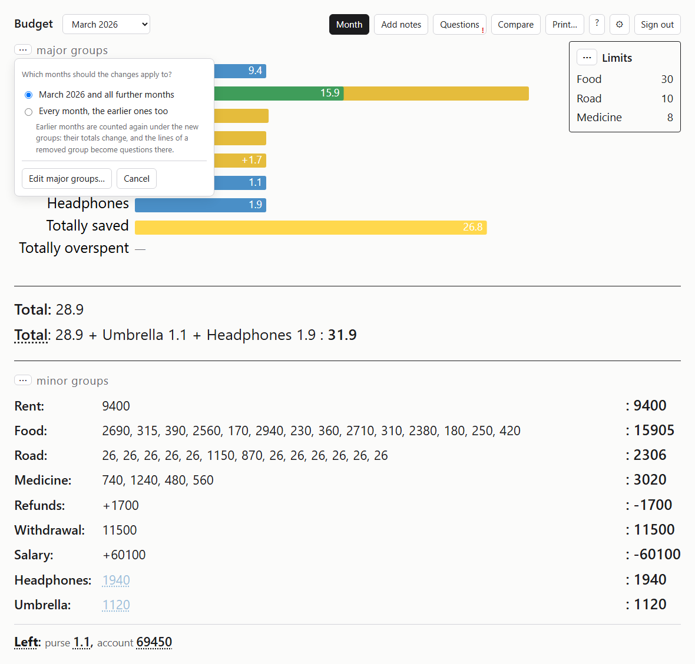

The card names the month you have open — for March 2026, say:

- **March 2026 and all further months** — the one already chosen, and the normal
  choice. The months you have already read and printed keep the groups they were
  read with; this month and every one after it take the new ones. Your life
  changed in March; February should stay as it was.
- **Every month, the earlier ones too** — when a group was wrong from the start.
  The card says what it costs: *"Earlier months are counted again under the new
  groups: their totals change, and the lines of a removed group become questions
  there."*

That warning is the reason the question is asked at all. Without it, removing a
group would quietly rewrite every month you had already looked at.

When the change is for this month on, your edits are **staged** — listed, and
applied together when you press Apply — so a half-finished reshaping never
lands.

### What the figures do while you reshape

Nothing is recomputed wrongly, because nothing is stored. Every total on the
page is worked out from your raw notes each time you look at it. Rename a group,
move a minor, change a limit — reload and the figures are simply right. The only
things stored are your notes and your answers.

Here is the same month after renaming three groups, changing a limit and adding
one:

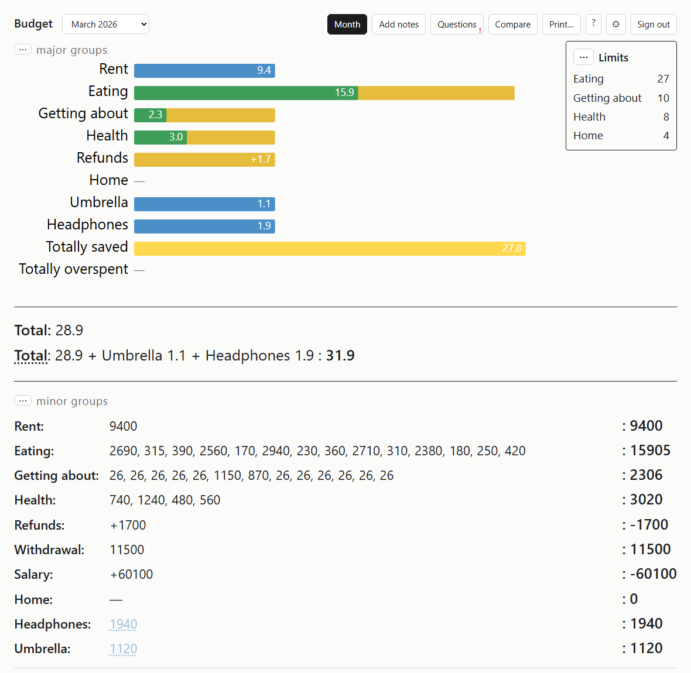

Same money, same figures, different words.

---

## The Left line

Optional, and easy to skip on a first read. It answers a different question from
the rest of the app: not *what did I spend* but **what have I got left, right
now**.

If you already end each day by writing down where you stand, the app reads that
line, keeps it in step as the month goes on, and tells you what today's figures
ought to be.

You write bare numbers in an order you keep, and the app puts the names on:

```
    you write            Left: 2.9, 71830

    the app shows        Left: purse 2.9, account 71830
```

Writing the names in yourself, as the example months do, works as well.

The order is yours and so are the names. The app starts with two, the ones in
the pictures here:

| Figure | What it is | What it is for |
| --- | --- | --- |
| **purse** | the cash you are actually spending from, in thousands | the everyday cash figure |
| **account** | the balance of the account your card pays from, written in full | it should match your banking app; when it does not, a day is missing |

### Typing a figure yourself

Every figure of the Left line under a month can be clicked. Type a number and it
takes the place of what the notes give for that month, marked as yours - the way
a figure you set in the Totals is marked - and the notes' own figure shows under
the pointer. **Back to the notes' figure** takes yours away again. Where a figure
has no value, a small **value…** button stands in its place.

Before you have pasted any month, the same buttons on the empty page set your
**starting figures**: where your money stands now. A month whose notes carry no
Left line of their own counts on from them through its days, and the next such
month counts on from the one before it. A month you write Left lines in reads
them, as always.

### The kinds, and why they matter

Each figure has a **kind**. The kind is not decoration — it is how the app
brings a half-written month up to date, so that today's line is right even
though you last wrote one on Tuesday.

| Kind | What the app does with it |
| --- | --- |
| **card balance** | every card payment comes off it |
| **cash in hand** | everything else comes off it |
| **weekly purse** | refills on a day you choose, and is spent down by groups you choose |
| **carried over** | stands unchanged until you write a new figure yourself |

So *purse* is cash in hand and *account* is a card balance. The other two kinds
are for figures you add: a weekly purse for money that refills on its own — a
week's food money, say — and carried over for a figure only you ever change,
such as a savings figure. A withdrawal moves money from the card to the cash,
which is why those two are one ledger and not two.

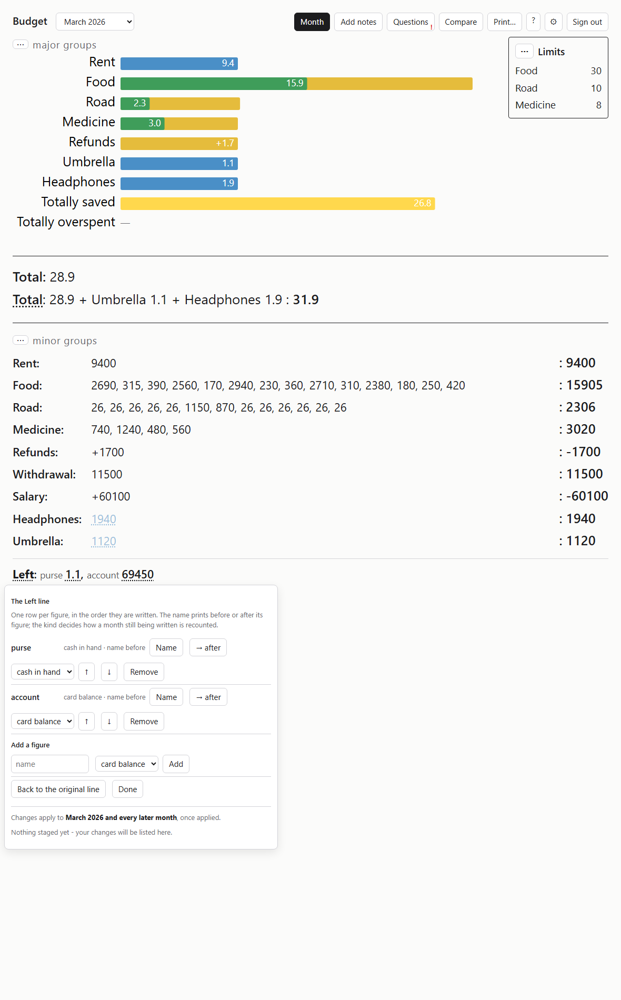

Click the word **Left** at the foot of the month to open that. You can rename
each figure, change its kind, put its name before or after the number, reorder
them, add up to twenty, or remove the ones you do not keep. **Back to the
original line** puts back the pair the app starts with.

Rename them to whatever you actually track. If you do not write such a line at
all, ignore this section — nothing else depends on it.

---

## Correcting a figure

Any amount on the month page can be clicked and moved, not only the ones you
were asked about.

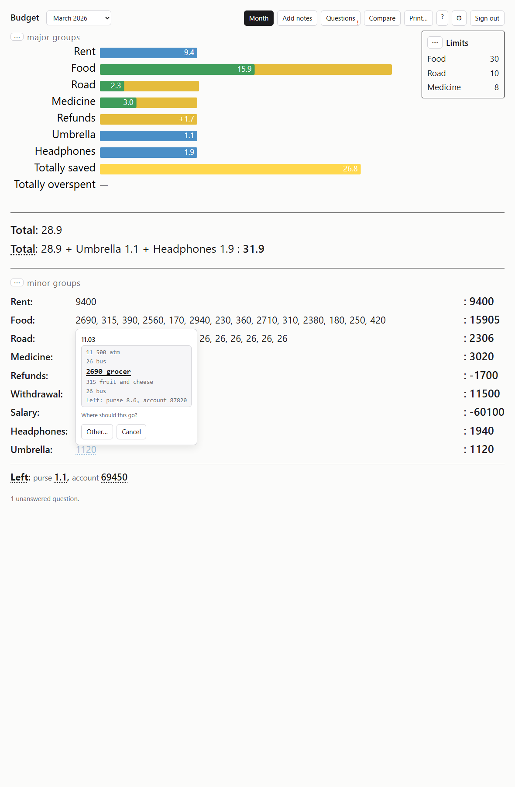

The popup shows the day the figure's line was written on, as a question does —
the date, that day's lines as you wrote them, the figure's own line in bold, in
a box that scrolls — and offers somewhere to put it. A month holds many figures
alike, so the day is how you tell this 26 from the others. A figure made of
several lines, such as an outing with its fares, shows each day they come from.
If you
have moved it before, **Put it back** lifts your move, and your answer if you
gave one, or else the rules, decide again.

**What you decide always wins.** A figure you answered or moved stays exactly
where you put it — whatever the rules say about it, including rules added to
the app after you decided, and including after you restore a backup. The rules
only place the figures you have never ruled on. So a backup restored into a
newer version of the app shows the month you saved, not a new reading of it.

That cuts both ways: an old answer also outranks a rule you asked for later. If
a figure sits somewhere you no longer want it, click it and choose again — that
is the only way it moves.

Figures carry a mark saying how they got where they are: one you answered, one
you moved, and one the rules placed all look slightly different. Point at one to
be told which.

**Old months lock themselves.** Three months after a month ends it becomes
read-only, so a stray click cannot change a figure you have already acted on. If
you genuinely need to correct one, the bar at the top of the month unlocks it and
says plainly that you may be changing something you already printed.

---

## Comparing months, and printing

**Compare** puts months side by side in one table: every group, every month, and
an average. Tick the months you want — it opens on the two most recent, which is
usually the question.

**Average** works out the average of exactly the months you have ticked. The
year buttons tick a whole year, and a year in progress ends with a month still
being written, which drags the average down; untick that month and press
*Average* to see the year as it actually stands. *Print…* then prints whatever
you last drew, average included.

**Print…** produces the month, or the whole year, as a Word or text file laid out
for paper.

---

## The gear menu

The **⚙** button, top right, holds what you set once and rarely touch:

- **Language** — English or Русский; see [Language](#language) just below.
- **Bar colours and text sizes** — every colour on the chart and every type
  size, dragged live. These live in this browser, not in your data; the backup
  file carries them too, so a restore brings them back.
- **Account** — *Recovery questions* opens the page for setting or changing
  them (see [Your account](#your-account)). The manual itself is the **?**
  beside the gear, which opens this guide in a new tab.
- **Backup** — see [Backups](#backups).
- **Start over** — wipes this month, this month onward, or everything. It asks
  twice and cannot be undone. *Everything* brings back the groups the app
  starts with.

The app also **opens where you left it**: the view you were on — except
*Add notes*, which is a thing you do rather than a place to sit, so it always
greets you with your figures — and always on the newest month. The view is
remembered in this browser.

### Language

**Language** comes first in the gear menu: *English* or *Русский*. English is
where every copy starts, unless Русский was chosen before it was set up.

- **What switches:** everything the app writes itself — the menus, buttons and
  messages, the questions it asks, Compare and the printouts, and this guide,
  which the **?** opens in the language you chose.
- **What never switches:** anything that is yours. The names of your groups and
  limits, the names on your Left line, the words you taught and your notes stay
  exactly as they are.
- **The groups swap only on an untouched app.** The app starts from one of two
  households: the same groups and limits, named in English — Rent, Food, Road,
  Medicine — or in Russian, each reading notes in its own words. While nothing
  has been added, answered, moved, edited or taught, switching the language also
  puts the household of that language in place of the other. After that, a
  switch changes only the words on screen. **Start over** → *Everything* brings
  back the household of the language you have chosen.
- **Your notes keep their own words.** The words the app reads your notes by —
  `Left:`, `card`, `do not count` and the rest — belong to the household, not to
  the screen. The English household reads the English words, whichever language
  the screen is in; the Russian household reads Russian ones, and the English
  ones too. The Russian guide lists them. Reading a screenshot follows the
  household the same way.
- **Before you sign in**, the sign-in pages offer **English · Русский**, and
  setting up from the Russian page starts the app in Russian, with the Russian
  household.
- **It travels with the file.** This browser remembers your choice, and
  **Download configuration** writes it into the file, so a restore brings the
  language back with everything else.

---

## Backups

Gear (**⚙**) → **Download configuration** saves everything — months, answers,
groups, limits, colours, the language — as one file. **Restore from a file…**
reads it back.

The file also carries your rules - one file holds everything - so the phone app
restores it with every month reading exactly as it does here. The phone refuses
a file saved before this, which has no rules in it: save a new one. Restoring here keeps this
app's own rules; if the file was made with different ones, the message after
the restore says so. The one exception is a file made with the other household
this copy carries: that household is put in place first, so the months read as
they did where the file was made. The file holds all your figures and your
rules — keep it where only you can see it.

Two habits worth having:

- Take one before any big reshaping of groups.
- Take one occasionally anyway, and keep it somewhere other than this computer.

The whole folder is also portable: close the app, zip the folder, and it will
run from anywhere you unzip it, with your data and your login inside. The backup
file is for when you want a snapshot rather than the whole thing.

---

## When something looks wrong

**A figure is in the wrong group.** Click it and move it. If it keeps landing
wrongly in later months too, teach the app the word you write — see
[Teaching it a word](#teaching-it-a-word).

**A total moved by 0.1 for no reason.** Each major group is rounded to one
decimal and only then added up, so moving one line between groups can shift a
total by a tenth. This is deliberate: the total is the sum of the rounded
figures on the bars.

**A month is missing.** It probably has no opening income line, so nothing told
the app where it starts. Paste the notes again from the top of the note.

**A day appears twice.** It should not — the fuller copy replaces the shorter
one. If it does, the two copies have different dates written on them.

**Everything is a question.** Usually the first month, and it settles quickly.
The app starts with few words on purpose, so your notes will use many it has
never seen: answer them once each, and teach it the words that come back month
after month — see [Teaching it a word](#teaching-it-a-word).

**The page says a month is closed.** It is more than three months old. Open it
and use *Unlock this month*.

**You have forgotten your password.** Use *Forgotten your password?* on the
sign-in page and answer your recovery questions. If you never set any, or cannot
answer them, delete `data/users.json` and the app will ask you to set up again;
your notes are in `data/store.json` and are not touched. See
[Your account](#your-account).

---

For installing, moving and running the app — and what to do when it will not
start — see [README.md](README.md).
