# Учёт бюджета — справка

Для тех, кто открыл приложение впервые и никогда раньше не заводил групп и
лимитов. Здесь не предполагается ничего, кроме того, что вы записываете свои
траты.

Читать по порядку не обязательно. Если хотите просто начать, прочитайте разделы
**Идея** и **Как записывать день**, добавьте месяц и возвращайтесь сюда, когда
какое-нибудь слово на экране станет непонятным.

- [Идея](#идея)
- [Что вы видите сначала](#что-вы-видите-сначала)
- [Ваша учётная запись](#ваша-учётная-запись) — одна учётная запись и как снова войти
- [Как записывать день](#как-записывать-день) — единственный формат, который нужно выучить
- [Как добавить месяц](#как-добавить-месяц)
- [Вопросы](#вопросы) — зачем приложение спрашивает и как научить его слову
- [Как читать месяц](#как-читать-месяц)
- [Группы](#группы) — **единственная идея, которую стоит понять как следует**
- [Уровни и два итога](#уровни-и-два-итога)
- [Лимиты](#лимиты)
- [Своя настройка с нуля](#своя-настройка-с-нуля)
- [Строка остатка](#строка-остатка)
- [Как исправить сумму](#как-исправить-сумму)
- [Сравнение месяцев и печать](#сравнение-месяцев-и-печать)
- [Резервные копии](#резервные-копии)
- [Меню настроек](#меню-настроек) — и [язык](#язык)
- [Если что-то выглядит не так](#если-что-то-выглядит-не-так)

---

## Идея

Большинство приложений для бюджета просят отнести покупку к категории в ту же
минуту, когда вы её сделали. Это приложение так не делает. Вы продолжаете вести
записи так, как уже ведёте, — дата, список сумм, слово-другое к каждой — и
вставляете их, когда удобно. Приложение их читает, раскладывает по группам,
складывает и спрашивает о тех немногих строках, которые не смогло уверенно
отнести к группе.

Так что круг такой:

```
    пишете записи в телефоне  →  вставляете их  →  отвечаете на пару вопросов
                              →  смотрите месяц
```

Ничто не уходит с вашего компьютера. Нет ни учётной записи где-то в сети, ни
синхронизации, ни сервера — кроме того, что работает на вашем же компьютере,
пока открыто окно.

**Суммы показываются в тысячах.** Полоса с числом `15.9` означает 15 900 в той
валюте, в которой вы пишете; дробная часть на экране отделяется точкой.
Приложение ничего не пересчитывает из одной валюты в другую: оно только
складывает записанные вами числа.

---

## Что вы видите сначала

Пока вы ничего не добавили, приложение показывает месяц таким, каким он будет,
только пустым: основные группы полосами наверху, лимиты в своей рамке рядом,
итоги, подгруппы ниже и строку остатка в самом конце — каждая группа на своём
месте, по нулям.

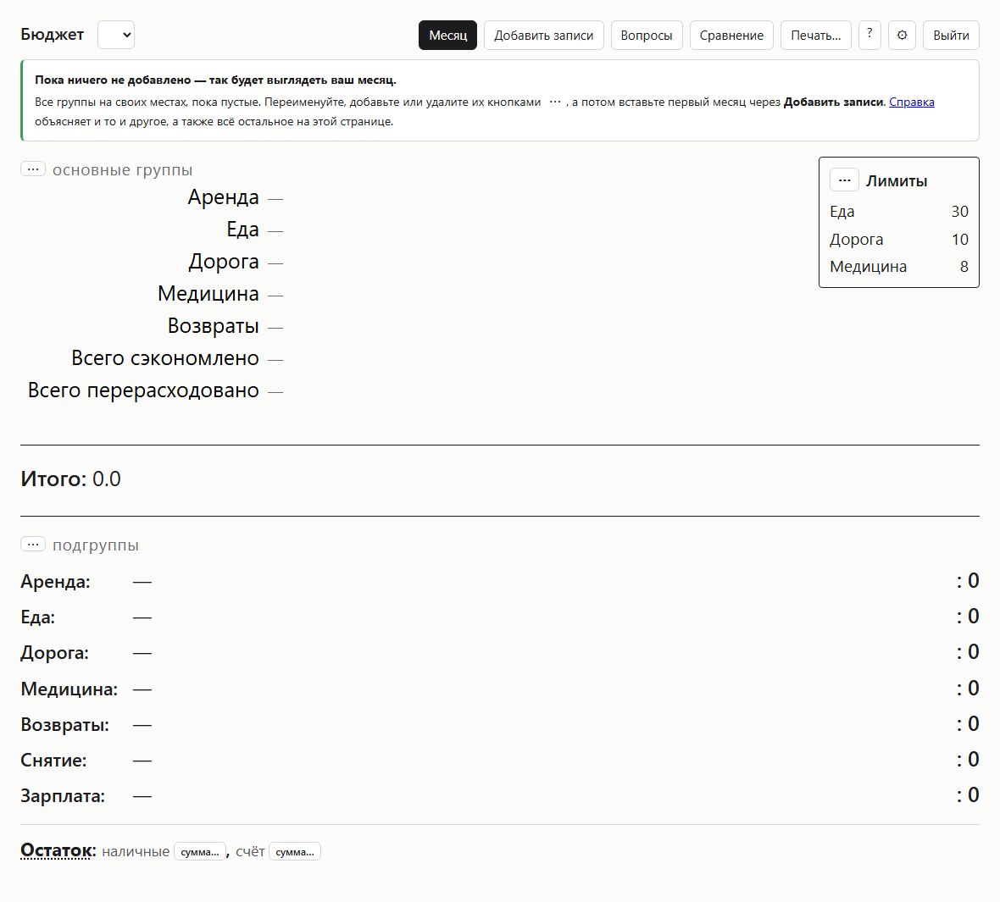

**Групп немного, и это нарочно.** Для трат их четыре: «Аренда», которая несёт
плату за жильё и больше ничего, и «Еда», «Дорога» и «Медицина», у каждой свой
лимит на месяц — 30, 10 и 8 тысяч. Под ними — «Возвраты», куда попадают
вернувшиеся деньги.

Это отправная точка, а не приговор. Кнопки **⋯**, каждая рядом с тем, что она
меняет, работают уже сейчас: переименуйте группы в свои, добавьте недостающие и
удалите лишние ещё до того, как вставите хоть одну запись, — большинству людей
удобен именно такой порядок. Пока ничего не добавлено, ни одно изменение не
спрашивает, к каким месяцам оно относится: месяцев, о которых можно спросить,
ещё нет. А можно сразу нажать **Добавить записи** и начать с месяца: та же
страница заполнится, как только он появится.

Эту страницу вы увидите снова, если когда-нибудь сотрёте всё через
*Начать заново*.

---

## Ваша учётная запись

При первом открытии приложение просит создать учётную запись. Она в нём ровно
одна, и как только она создана, эта страница больше не появляется.

Вверху страницы есть строка **English · Русский**. Чтобы сразу работать
по-русски, на первой странице нажмите «Русский» ещё до того, как создадите
учётную запись: тогда приложение запустится на русском, с теми же группами,
названными по-русски, — см. [Язык](#язык).

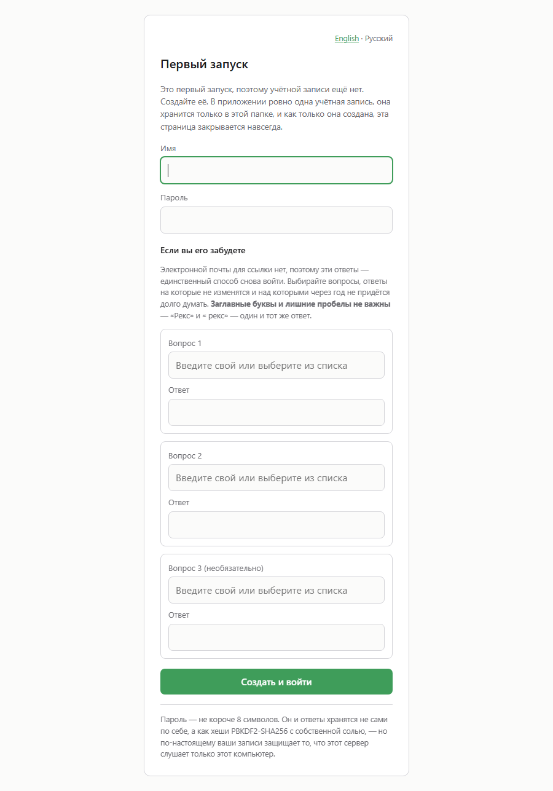

Кроме имени и пароля страница просит задать **контрольные вопросы**. Не
пропускайте их: это единственный способ снова войти. Нет электронной почты, на
которую можно прислать новый пароль, и некого попросить о помощи — приложение
целиком работает на вашем компьютере и ничего о вас не знает.

Два вопроса обязательны, третий — по желанию. Несколько советов, как их
выбрать:

- **Выбирайте ответы, которые не изменятся.** Кличка первого питомца останется
  той же навсегда, а любимый ресторан — нет.
- **Выбирайте ответы, которые не придётся восстанавливать.** Если нужно
  вспоминать, что бы вы ответили, через два года вы ошибётесь.
- **Слово или число, которое придёт в голову только вам, — вполне хороший
  «вопрос».** Поэтому он и стоит последним в списке подсказок.
- **Заглавные буквы и лишние пробелы не важны.** `Рекс`, `рекс` и `  РЕКС ` —
  один и тот же ответ. Всё остальное учитывается, в том числе знаки
  препинания.

### Как снова войти

На странице входа есть ссылка **Забыли пароль?**

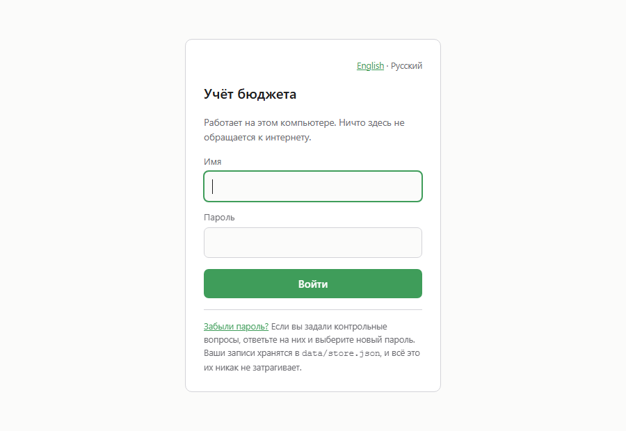

Она задаёт ваши вопросы и, если все ответы верны, даёт выбрать новый пароль и
сразу впускает вас.

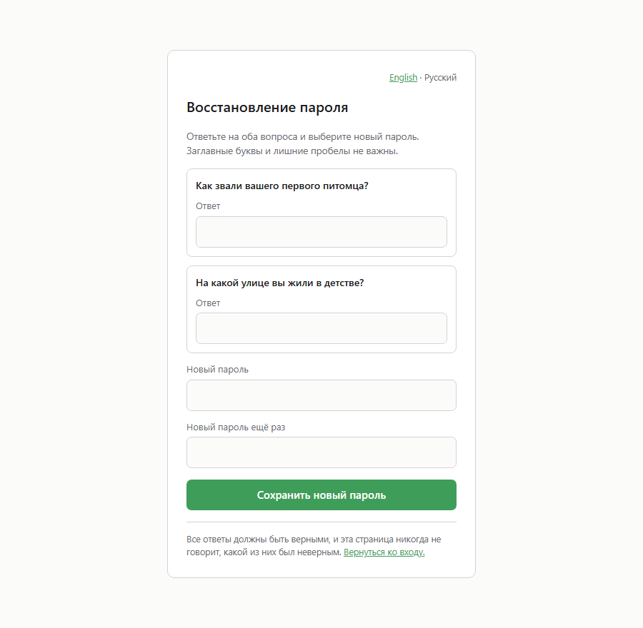

Что стоит знать заранее:

- **Верными должны быть все ответы**, и страница никогда не говорит, какой из
  них неверен. Иначе кто-то мог бы подбирать ответы по одному.
- **После пяти неверных попыток вопросы не задаются четверть часа.** Кличку
  питомца угадать куда проще, чем пароль, поэтому попытки считаются.
  Закрываются только вопросы: если вы помните сам пароль, войти можно как
  обычно.
- **Ваши записи здесь ни при чём.** Они хранятся в `data/store.json`, а вход —
  в `data/users.json`. Ничто, связанное с паролями, первый файл не трогает.

### Как сменить вопросы

Когда вы вошли, откройте **http://127.0.0.1:8765/security**.

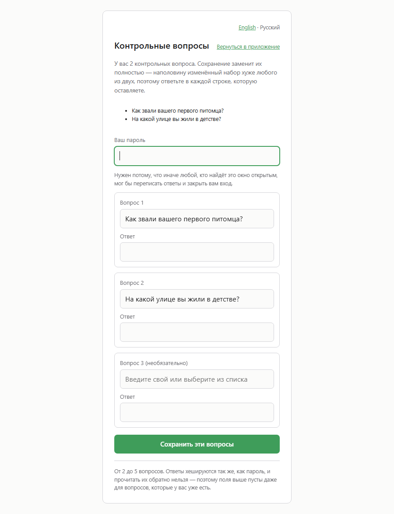

Сначала страница спрашивает пароль: иначе любой, кто застал окно открытым, мог
бы тихо заменить ответы на свои. Сохранение заменяет весь набор, а не правит
его, поэтому ответьте в каждой строке, которую хотите оставить.

Поля для ответов пусты даже для вопросов, которые у вас уже есть. Иначе и быть
не может: ответы хранятся так же, как пароль, — в виде хеша, из которого нельзя
получить обратно то, что вы ввели.

### Если войти никак нельзя

Удалите `data/users.json`. Приложение предложит создать учётную запись заново,
точно так же, как при первом запуске. **Пропадёт только вход и больше ничего** —
ваши записи хранятся в `data/store.json`, это другой файл, и его это не
затронет.

Это стоит знать и само по себе: пароль — замок от тех, кто сядет за ваш
компьютер, а не сейф. Кто может удалить файл, тот и так может войти.
Контрольные вопросы — это удобство, и защиты они не ослабляют.

---

## Как записывать день

Это единственный формат, который нужно выучить, и он нарочно близок к тому, как
люди и так делают пометки.

```
10.01
+ 57 300
9400 аренда картой
+ 210 не считать, относится к декабрю
Остаток: наличные 6,8, счёт 61240

11.01
26 автобус
2340 бакалея
135 яйца и сыр
26 автобус
Остаток: наличные 4,3, счёт 61240
```

Это первые два дня января из примера — одного из трёх придуманных месяцев,
которые идут вместе с приложением (см. [Месяцы-примеры](#месяцы-примеры)).

По строкам:

| Что вы пишете | Что это значит |
| --- | --- |
| `11.01` | дата, `дд.мм`. С неё начинается новый день. |
| `2340 бакалея` | сумма, а за ней — на что. По словам выбирается группа. |
| `9400 аренда картой` | слово `картой` говорит, что платили картой, а не наличными. |
| `26 автобус` | проезд. `автобус`, `такси`, `поезд`, `билет` и `бензин` — слова, которые приложение уже относит к «Дороге», — см. ниже. |
| `+ 57 300` | **плюс** делает строку поступлением денег, а не тратой. |
| `+ 210 не считать, относится к декабрю` | деньги другого месяца: они считаются в декабре, а здесь никогда. `не считать, прошлый месяц` отправляет их в предыдущий месяц. |
| `Остаток: …` | необязательно. Сколько у вас осталось к концу дня, в порядке, который вы выбираете сами. См. [Строка остатка](#строка-остатка). |
| пустая строка | граница между разными поездками в один день. **Это важно.** |
| `######` | три или больше `#` отдельной строкой: здесь месяц заканчивается, а следующий начинается со своей зарплаты. См. ниже. |

Четыре вещи, которые стоит знать с самого начала:

**Месяц начинается с зарплаты и заканчивается строкой из `#`.** Первая строка
записей месяца — доход, с которого он начинается: в примере это `+ 57 300`.
Когда месяц закончился, напишите после его последнего дня, перед следующей
зарплатой, отдельную строку из трёх или больше знаков `#`:

```
27.01
26 автобус
310 фрукты
26 автобус
Остаток: наличные 1, счёт 32500

######

10.02
+ 58 650
```

Если все месяцы у вас в одной заметке и вы вставляете её целиком, по этим
строкам приложение отличает один месяц от другого. Без такой строки дни
следующего месяца читаются как продолжение предыдущего. Если вставляете каждый
месяц отдельно, строку можно не писать. К *закрытию* месяца она отношения не
имеет: приложение закрывает месяц само, через три месяца после его окончания
(см. [Как исправить сумму](#как-исправить-сумму)).

**Пробелы в числах не мешают.** `57 300` и `57300` — одно и то же, как и
`9 500 банкомат` и `9500 банкомат`. Пишите так, как привыкли.

**Пустая строка разделяет поездки.** Если днём вы были в кино, а вечером в
магазине, поставьте между ними пустую строку. По таким границам приложение
решает, какой проезд к какой поездке относится: без них проезд до кино
прочитается как поездка за продуктами.

**Если не трудно, пишите, что это был за проезд.** `26 автобус` — строка
«Дороги», где бы она ни стояла. А проезд, записанный одной суммой, — `26`, и
больше ничего, — относится к поездке, внутри которой записан: по обе стороны от
`740 кино` в отдельном блоке приложение спросит, завести ли для этой поездки
группу и отнести ли к ней её проезд; в поездке за продуктами это «Дорога». В
любом другом месте ничто в строке не говорит, куда вы ездили, и приложению
приходится спрашивать.

### Слова записей

Некоторые слова в записях — не покупки, а пометки для приложения: строка
остатка, оплата картой, деньги другого месяца и другие. Эти слова принадлежат
семье — набору групп, с которым начинает приложение, — а не языку экрана (см.
[Язык](#язык)). Русская семья читает пометки из средней колонки, а заодно и
английские из правой — кроме подарка, у которого в английском другой порядок
слов; сами покупки она узнаёт по русским словам. Английская семья читает только
английские пометки, даже если экран на русском. Подробнее о них — в английской
справке: её открывает ссылка English вверху этой страницы, и она же переключает
на английский само приложение.

| Что это | Русская семья | Английская семья |
| --- | --- | --- |
| строка остатка | `Остаток:` (читаются и `Осталось:`, `Left:`) | `Left:` |
| дробная часть в строке остатка | запятая: `наличные 6,8` | точка: `purse 6.8` |
| оплата картой | `картой` (или `по карте`) | `card` |
| не считать: деньги за прошлый месяц | `+ 340 не считать, прошлый месяц` | `+ 340 do not count, previous month` |
| не считать: деньги другого месяца | `+ 210 не считать, относится к декабрю` | `+ 210 do not count, refers to December` |
| часть вернули прямо в магазине | `2860 бакалея (-120 возврат)` | `2860 grocer (-120 return)` |
| часть зарплаты, пришедшая раньше | `+ 20 000 аванс` | `+ 20 000 prepayment` |
| чаевые к строке перед ними | `70 чаевые` (или `70 на чай`) | `70 tips` |
| вторая сумма из той же строки | `1300 бакалея и 1к стрижка` | `1300 grocer and 1k haircut` |
| повод, названный первым | `670 21 января кафе картой` | `670 21st of January cafe card` |
| подарок | `360 ваза подарок новосёлам картой` | `360 vase housewarming gift card` |

### Деньги, которые возвращаются

Поставьте впереди `+`. Возврат покупки, возмещение, возвращённый долг.

```
+ 1200 возврат
```

Эта строка января из примера сама говорит, что она такое, и попадает в группу
«Возвраты», которая вычитается из итога месяца. А голый `+` прямо под покупкой,
за которую вернули деньги, примерно на ту же сумму, идёт туда же, куда эта
покупка:

```
620 сироп от кашля
+ 620
```

Возврат попадает в «Медицину», рядом с сиропом, и они взаимно гасятся, поэтому
возвращённая покупка в итоге даёт ноль, а не считается дважды.

### Деньги, которые относятся к другому месяцу

Допишите в конце строки *не считать, относится к* и месяц, когда деньги
относятся к тому месяцу, а не к этому, — например, возврат за покупку декабря,
пришедший в январе:

```
+ 1800 стремянка, не считать, относится к декабрю
```

Эта строка — декабрьская, а не январская, **даже если декабря в приложении
ещё нет**. Январь не считает её нигде и не показывает. Если декабрь в
приложении есть, строка встанет в его последний день. Если нет, приложение
заведёт для неё декабрь: он появится в списке месяцев с одной этой строкой,
датированной последним днём месяца, и скажет, что состоит из строк других
месяцев. Там строка читается, как любая строка декабря: правила отнесут её в
группу или спросят о ней в «Вопросах» декабря, где первой будет предложена
группа, названная в строке. Когда вы добавите собственные записи декабря —
новым месяцем или через «Добавить в» декабрь, — они встанут рядом с этой
строкой, а ваш ответ о ней сохранится. *Не считать, за прошлый месяц* делает
то же для предыдущего месяца.

---

## Как добавить месяц

**Добавить записи**, вставьте, **Добавить**.

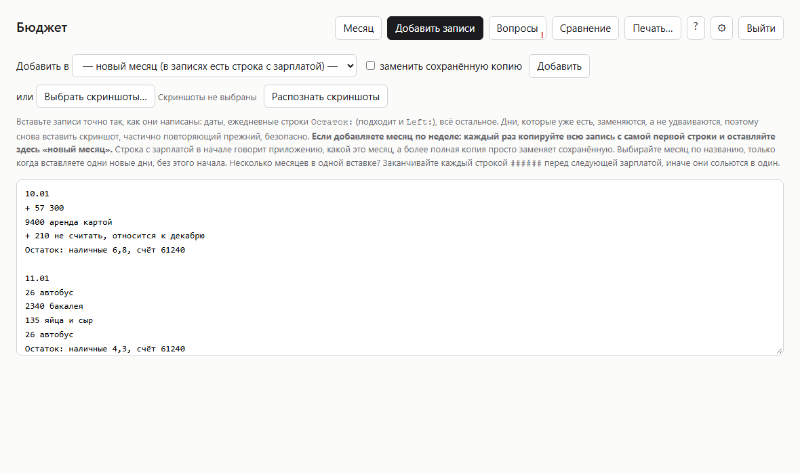

На этом экране стоит разобраться в двух вещах.

**«— новый месяц —» или месяц по названию.** Приложение понимает, к какому
месяцу относится вставка, по строке дохода, с которой она начинается, — по
зарплате или по тому, с чего у вас обычно начинается месяц. Если во вставке
есть эта первая строка, оставьте в поле «новый месяц», и всё разложится само.
Выбирайте месяц по названию, только когда вставляете несколько дней отдельно,
без первой строки, по которой их можно узнать.

**Вставлять повторно безопасно.** Если день уже сохранён, более полная копия
заменяет более короткую. Дни никогда не удваиваются. Поэтому самая простая
привычка — всякий раз, когда хотите внести новое, копировать всю заметку с
самой первой строки и вставлять её целиком. Если в заметке несколько месяцев,
каждый должен заканчиваться своей строкой `######` (см.
[Как записывать день](#как-записывать-день)).

### Месяцы-примеры

Вместе с приложением идут три придуманных месяца, в папке `examples\ru` рядом с
ним: те январь, февраль и март, которые цитирует эта справка, написанные под
группы, с которыми приложение начинает. Чтобы посмотреть на приложение в деле,
прежде чем писать что-то своё, откройте любой из них, скопируйте всё, что в нём
есть, и вставьте в **Добавить записи**. Они получают текущий год, а приложение
закрывает месяц через три месяца после его окончания: если месяц-пример
показан закрытым, нажмите *Открыть этот месяц* вверху, прежде чем отвечать на
вопросы или переносить суммы.

Когда будете готовы к своим записям, уберите их — см.
[Своя настройка с нуля](#1-уберите-месяцы-примеры-если-вы-их-вставляли).

### Со скриншота

Если записи ведутся в приложении на телефоне, сделайте скриншоты и, вместо того
чтобы перепечатывать, нажмите **Выбрать скриншоты…**, а затем **Распознать
скриншоты**. Текст появится в поле, чтобы вы проверили его перед добавлением, —
проверяйте всегда: распознавание иногда путает цифры, а это деньги.

Для этого нужна программа распознавания; см. [README.ru.md](README.ru.md). Всё
остальное работает и без неё.

---

## Вопросы

Приложение никогда не угадывает молча. Когда строка может относиться к двум
группам или ни к одной из известных, оно спрашивает — и пока вы не ответите,
сумма предварительная: строка, которую некуда отнести, не считается нигде, а
строка с вероятным местом пока считается там.

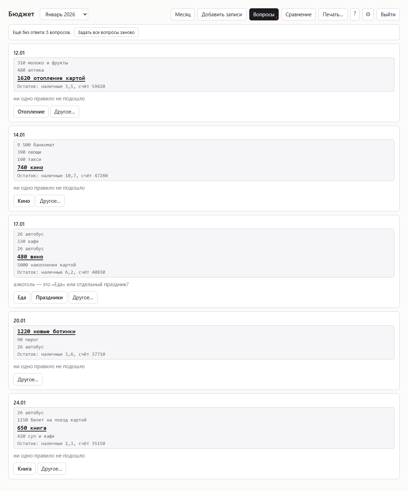

Каждый вопрос показывает день, когда записана его строка: дату, а под ней
строки этого дня точно так, как вы их написали, — с пустыми строками, приходами
и строкой остатка, — где спрошенная строка выделена жирным, в окне, которое
открывается на ней и прокручивается по всему дню. Он говорит, в чём
сомнение, и предлагает вероятные ответы. Кнопки — это подсказки, а не меню:
**Другое…** позволяет ввести название любой группы, а если такой группы ещё
нет, приложение предложит завести новую группу с этим названием. Если название
отличается одной буквой от уже существующей группы — *Тетр* там, где есть
*Театр*, — приложение сначала спросит *Вы имели в виду «Театр»?*: «да»
отнесёт строку туда, «нет» заведёт новую группу.

На снимке — январь из примера, пять вопросов двух видов:

- **`1620 отопление картой` — «ни одно правило не подошло».** Ничто в строке не
  совпадает с группами, которые знает приложение. Оно выбрало слово, больше
  всего похожее на название, и предлагает его как новую группу — это одно
  нажатие вместо набора текста. `740 кино` и `650 книга` спрашивают о том же; у
  `1220 новые ботинки` нет слова, которое можно предложить, поэтому группу для
  неё вводят через **Другое…**.
- **`480 вино` — «алкоголь — это „Еда“ или отдельный праздник?»** Строку
  действительно можно прочитать двояко, и от ответа месяц меняется. Пока вы не
  ответили, она считается в «Еде».

Февраль из примера снова спрашивает об отоплении, о стрижке и о новой лампе;
март — об отоплении, о зонте и носках и о наушниках.

Стоит знать ещё три вида вопросов:

- **Группа, которую вы удалили.** Её строки возвращаются сюда, и о каждой
  приходит вопрос *«группу „Еда“ удалили — куда это отнести?»*; пока вы не
  ответите, строка не считается нигде. См. [Как удалить группу](#как-удалить-группу).
- **Строка, в которой названы две группы.** `450 пирог и таблетки` — это и
  еда, и лекарства сразу, поэтому приложение не выбирает само: оно спрашивает
  *«в строке названы Медицина и Еда — что именно это было?»* и предлагает на
  кнопках обе группы.
- **Слово внутри другого слова.** Правила относят к «Еде» `еду`, `еды` и
  `еде` — а `еде` сидит и внутри слова `обеденный`, для которого правило
  никогда не писали. Когда правило совпадает только с серединой более длинного слова,
  приложение не относит строку по одному этому совпадению. О строке
  `450 обеденный стол` оно спрашивает
  *«„обеденный“ — это не „еде“: к какой группе это отнести?»* и предлагает
  первой отдельную группу `Обеденный`, а рядом — `Еда`.

**Ответы запоминаются для каждого месяца и каждой строки отдельно.** Ответ
*вино → Праздники* в январе не решает молча, что делать со следующим вином, в
феврале или позже: одни и те же слова в разные месяцы могут значить разное.

**«Задать все вопросы заново»** забывает ответы этого месяца и возвращает все
вопросы. Суммы снова становятся такими, какими их делают записи по одним только
правилам. Пригодится, если вы передумали, как читать месяц.

### Как научить приложение слову

Ответ на вопрос решает судьбу одной строки в одном месяце. Об отоплении
приложение спрашивает в январе, снова в феврале и снова в марте: какие слова к
какой группе относятся, оно знает только по немногим словам, с которыми
начинает, а ваших магазинов среди них нет.

Поэтому его можно научить. Шестерёнка (**⚙**) → **Выученные слова…** принимает
слово и группу, к которой оно относится. С этого момента любая строка с этим
словом сразу относится туда, и вопроса о ней нет.

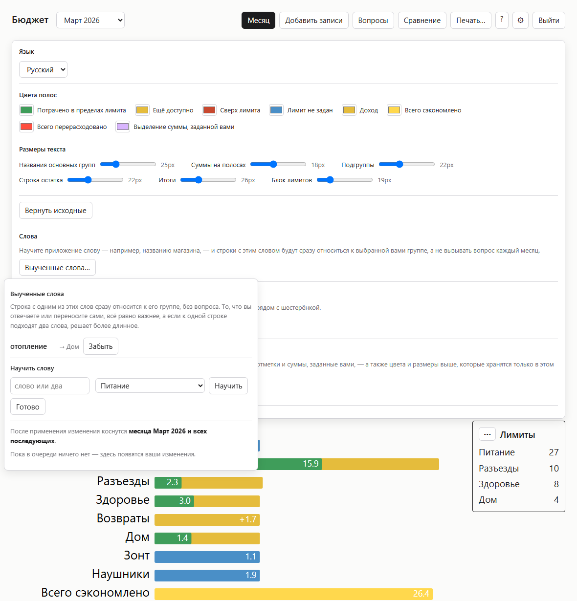

Слово учат для подгруппы, которая уже есть, а у отопления её пока нет. Поэтому
сначала заведите её: основную группу «Дом» и подгруппу «Дом» в ней (см.
[Группы](#группы)). Потом научите приложение слову `отопление` для группы «Дом»
— и строки об отоплении будут относиться туда во всех месяцах, для которых
выучено слово.

Что стоит знать:

- **Сначала приложение спрашивает, к каким месяцам это относится**, когда
  месяцы уже есть, — как и редакторы групп: этот месяц и все последующие или
  все месяцы, и прошлые тоже. Если научить слову начиная с этого месяца,
  месяцы, которые вы уже прочитали и напечатали, останутся точно такими, как
  были.
- **То, что вы ответили или перенесли вручную, всё равно важнее.** Выученное
  слово касается каждой строки, где оно есть, а ответ — одной строки, и частное
  побеждает общее.
- **Если к строке подходят два слова, решает более длинное.** Научите `билет`
  для своей группы «Досуг» и `билет на поезд` для группы «Дорога» — и
  `1150 билет на поезд картой` возьмёт второе.
- **Слово, а не кусок слова.** `отопление` не совпадёт внутри
  `электроотопление` и не совпадёт с `отоплению`: слово узнаётся только в той
  форме, в которой вы его научили, поэтому учите ту форму, которую пишете.
  Можно научить и несколько слов вместе — `магазин у дома`, — тогда они
  совпадают при любом числе пробелов между ними.
- **Забыть** убирает слово, и строки с ним снова читаются по правилам или
  вызывают вопрос.

Выученные слова попадают в резервную копию вместе со всем остальным, так что
копия, восстановленная в другом месте, знает, чему вы её научили.

---

## Как читать месяц

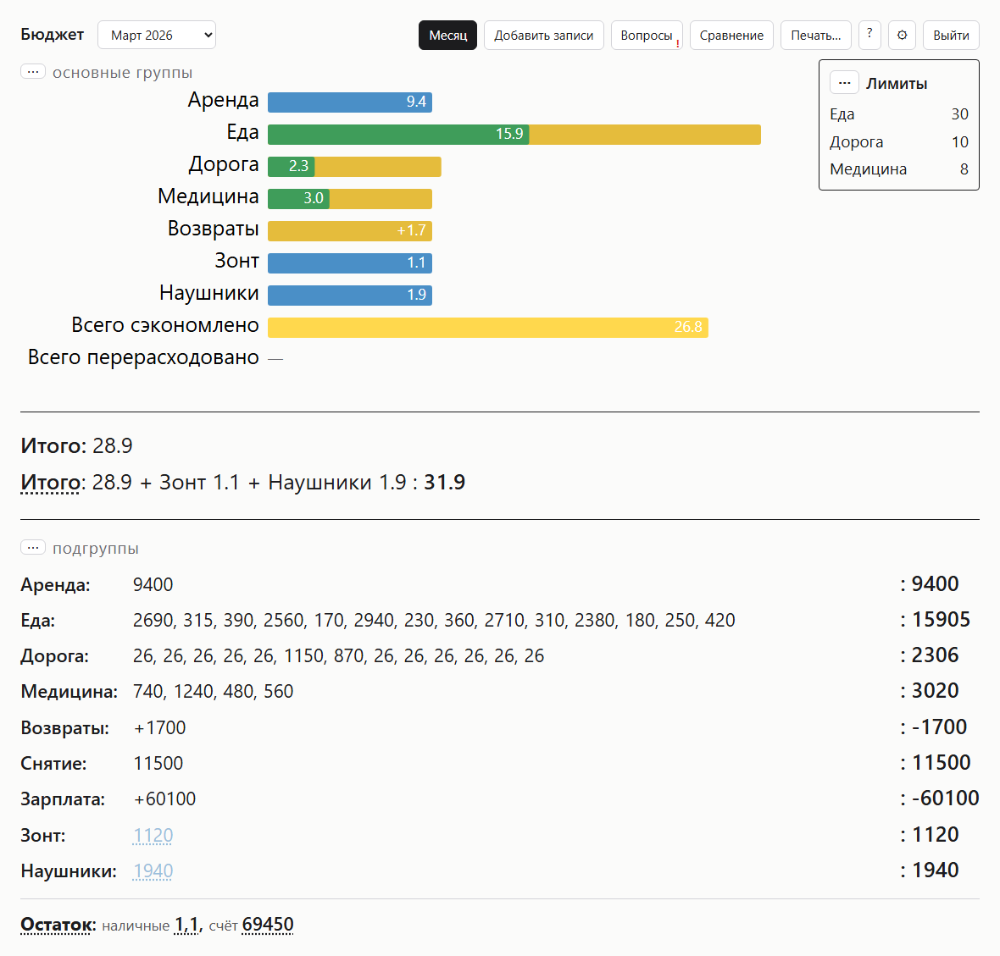

На этой странице четыре вещи.

**Полосы** — это ваши основные группы, по одной в строке, каждый месяц в одном и
том же порядке, чтобы страница всегда выглядела одинаково. Группа без трат
показывает прочерк, а не исчезает: её отсутствие — тоже информация.

- **Зелёный** — сколько вы потратили.
- **Жёлтый** рядом с зелёным — сколько ещё осталось до лимита группы.
- **Красный** — вы вышли за лимит, и красная часть — это перерасход.
- **Синий** — у группы вообще нет лимита.
- Две нижние строки, **Всего сэкономлено** и **Всего перерасходовано**,
  складывают весь жёлтый и весь красный. Это показатели, а не группы.

**Блок лимитов** справа — ваш план на месяц, в выбранном вами порядке.

**Два итога** объяснены в следующем разделе.

**Список подгрупп** под ними показывает каждую отдельную сумму, так что видно,
из чего складывается любое число. В этом вся его работа: не выборка из того,
что вы потратили, а **всё, собранное по группам**. Выше — март из примера, в
котором отвечены два вопроса из трёх: у группы `Еда` одна полоса с числом 15.9,
а под ней строка `Еда` списка несёт все четырнадцать её покупок, за наличные и
картой, и вместе они дают 15 905.

Вся страница целиком, чтобы было видно, как стоят друг относительно друга её
четыре части:

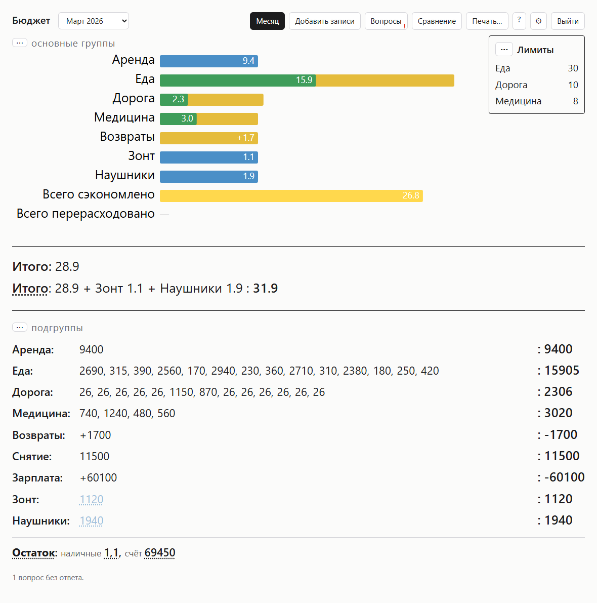

---

## Группы

Это единственная идея, которую стоит понять как следует. Всё остальное следует
из неё.

Группы устроены **в два этажа**.

**Подгруппа** — это место, куда попадает отдельная строка. `2340 бакалея`
попадает в одну подгруппу, `26 автобус` — в другую.

**Основная группа** — то, во что складываются несколько подгрупп. Основные
группы — это то, что вы видите на диаграмме, за чем следят лимиты и из чего
складываются итоги.

В группах, с которыми приложение начинает, под каждой основной группой одна
подгруппа с тем же названием. Вот «Дорога» января из примера, после того как в
неё добавили подгруппу «Такси» и научили приложение слову `такси` для неё:

```
    Дорога              ← основная: одна полоса, один лимит, одно число (2.4)
      Дорога    2260    ← подгруппа: автобусы, бензин, поезд
      Такси      160    ← подгруппа: 160
```

**Зачем два этажа?** Потому что вам нужны две разные вещи сразу. Глядя на месяц,
вы хотите видеть *одно* число за все разъезды, а присмотревшись — видеть такси
и автобусы по отдельности. Один этаж заставил бы выбирать. Поэтому подгруппы
хранят подробности, а основная группа их складывает.

Использовать оба этажа не обязательно. Основная группа с единственной
подгруппой — это совершенно нормально, и именно такие все группы, с которыми
приложение начинает.

**«Аренда» — единственная группа, не похожая на другие.** Она несёт арендную
плату из ваших записей — в месяцах-примерах это `9400 аренда картой` — и больше
ничего, и держит эту сумму, пока не будет записан новый платёж. Оставьте её
только для аренды: всё остальное, что в неё попадёт, эта сумма просто заменит.

### Где редакторы

У каждой части, которую можно править, своя кнопка **⋯**, а нажатие на слово
**Остаток** в последней строке открывает четвёртый редактор:

| Кнопка | Где она | Что правит |
| --- | --- | --- |
| **⋯** | над диаграммой, у надписи «основные группы» | основные группы |
| **⋯** | в блоке лимитов, перед словом «Лимиты» | лимиты |
| **⋯** | над списком подгрупп, слева, как и две другие | подгруппы |
| **Остаток** | последняя строка внизу месяца | строка остатка |

Пока месяцев нет, три кнопки **⋯** стоят рядом над группами. Когда месяцы уже
есть, каждый редактор, кроме редактора лимитов, перед тем как открыться,
спрашивает, *к каким месяцам применить изменения*, — это объяснено в разделе
[Своя настройка с нуля](#8-как-менять-группы-когда-месяцы-уже-есть).

#### Подгруппы

У каждой видно, в какую основную группу она входит. Пункт **перенести в…**
переносит её в другое место — так вы и перестраиваете группы: решили, что
такси — это скорее отдых, чем разъезды, — перенесите `Такси` в свою основную
группу. Месяцы, которых касается изменение, пересчитываются сразу. **Удалить**
убирает подгруппу, а строки, которые в ней были, уходят в «Вопросы».

Несколько подгрупп могут входить в одну основную группу — именно так десяток
разрозненных строк превращается в одну сумму. **Добавить** просит название и
основную группу, в которую подгруппа входит, и без того и другого не
добавляет.

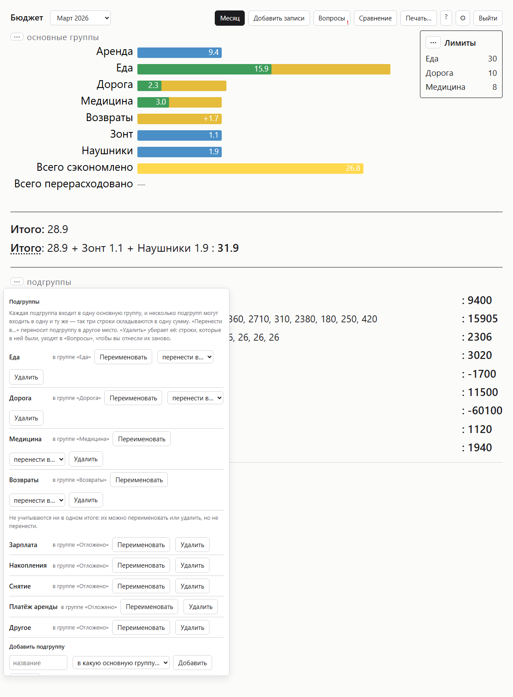

#### Основные группы

Кнопки **Переименовать** и **Удалить**, а также **Добавить**: она просит
название, [уровень](#уровни-и-два-итога) и, если хотите сразу, лимит.
**Удалить** убирает основную группу вместе с её подгруппами; одна группа для
расходов остаётся всегда. **Переименовать** переименовывает и подгруппу с тем же
названием, что у основной группы, — подгруппу `Еда` в группе `Еда`, — а
подгруппе можно дать название её собственной основной группы, но не какой-то
другой. У добавленной основной группы подгрупп поначалу нет: добавьте
подгруппу, прежде чем учить для неё слово, или ответьте на вопрос её названием —
тогда строка ляжет туда.

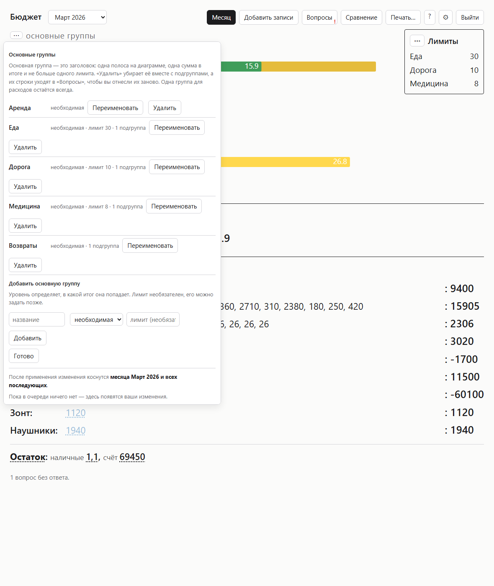

**Названия — это подписи, а под ними постоянные идентификаторы.** Поэтому группу
можно переименовать, и каждый старый месяц, каждый сохранённый ответ и каждое
правило продолжат работать. Меняется только слово на экране.

### Как удалить группу

Удалить можно любую группу и в любой момент, кроме последней, куда могут идти
расходы, — подгруппу саму по себе или основную группу вместе с её подгруппами.
Ничто из того, что она считала, не пропадает. Каждая её строка возвращается в
«Вопросы» с вопросом *«группу „Еда“ удалили — куда это отнести?»* и не
считается нигде, пока вы не ответите. Пока нет ни одного месяца, строк нет, и
группа просто исчезает.

Если удалить подгруппу, её основная группа остаётся — пустой полосой, по-прежнему
со своим лимитом; удалите и основную группу, когда полоса станет не нужна. Лимит
вообще не держит строк, поэтому его удаление ни о чём не спрашивает.

Группы из «Отложено» — зарплата, накопления, снятие, платёж за аренду и
«в другом месяце» — тоже есть в редакторе подгрупп, под остальными: их можно
переименовать или удалить, как любые другие, но не перенести в другую основную
группу — строка, отправленная туда, перестала бы учитываться. Зарплата сначала
спрашивает: в неё попадает строка зарплаты, которая тогда уйдёт в «Вопросы» и
будет учтена там, куда вы её отнесёте.

### Группы, с которыми приложение начинает, — только отправная точка

Приложение начинает с рабочего набора групп, чтобы первому вставленному месяцу
было куда лечь: аренда, три широкие группы, на которые тратит почти каждый, и
лимиты, подобранные под месяцы-примеры. Каждая сумма в этих месяцах и на
снимках в этой справке придумана. **Ничто из этого не обязано быть вашим.** См.
[Своя настройка с нуля](#своя-настройка-с-нуля).

---

## Уровни и два итога

У каждой основной группы есть **уровень**, и он решает, как группа попадает в
итог месяца. Уровней четыре.

| Уровень | Что он значит | Куда попадает |
| --- | --- | --- |
| **необходимая** | обычная жизнь, месяц за месяцем | в **первый итог** |
| **частая** | настоящие траты, но не каждый месяц | прибавляется *после* первого итога |
| **разовая** | однократное — поездка, ремонт, подарок | прибавляется *после* первого итога |
| **исключённая** | записывается, но нигде не считается | ни в один итог |

Отсюда и два итога на странице месяца. Март из примера, в котором зонт и
наушники отнесены к отдельным группам:

```
    Итого: 28.9                                ← только «необходимые»
    Итого: 28.9 + Зонт 1.1 + Наушники 1.9 : 31.9
```

**Зачем два?** Потому что «сколько стоит моя жизнь?» и «сколько я на самом деле
потратил?» — разные вопросы, и если их смешать, оба ответа станут бесполезны.
Месяц, в котором купили новые наушники, не доказывает, что продукты подорожали.
Первый итог — сравнимый, месяц к месяцу. Второй — правда о вашем счёте в банке.

**Для чего «исключённая».** Некоторые строки нужно записать, но нельзя считать.
Самый ясный случай — наличные, снятые в банкомате: если бы считалось и снятие,
и покупки, сделанные на эти наличные, вы потратили бы деньги дважды. С
переводом в сбережения то же самое: записано, но не потрачено. Приложение
начинает с одной такой группы, «Отложено»: зарплата, накопления, снятые
наличные и сам платёж за аренду (сумму аренды несёт «Аренда»). Денег,
относящихся к другому месяцу, в ней нет: их считает тот месяц (см.
[Деньги, которые относятся к другому месяцу](#деньги-которые-относятся-к-другому-месяцу)).

### Что учитывает второй итог

Нажмите на слово **Итого** во второй строке.

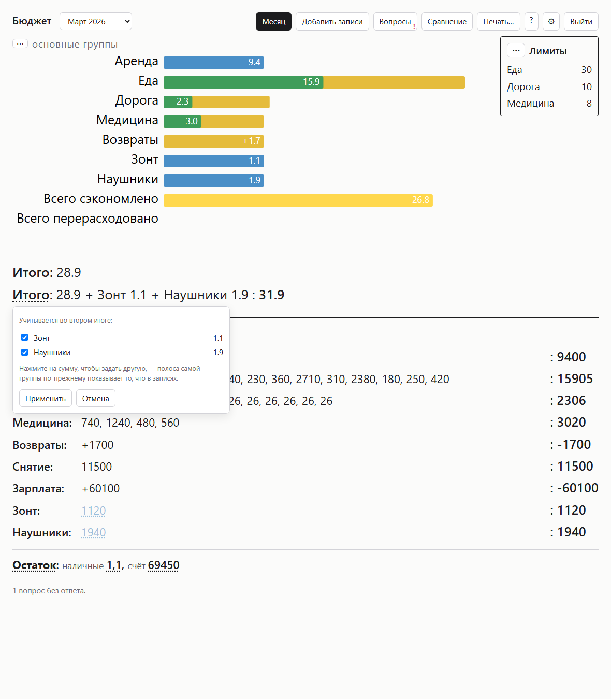

Каждая разовая группа появляется с отметкой. Снимите отметку — и группа выпадет
из этого итога: полоса и подробности у неё остаются, ведь это всё равно было,
но месяц она больше не окрашивает. Нажмите на саму сумму, чтобы ввести другую, —
на случай, когда потраченное и то, что должен нести месяц, не совпадают.
Заданная вами сумма помечается, так что её никогда не спутать с посчитанной.

---

## Лимиты

Лимит — это число на месяц, которое вы задаёте для одной основной группы. Он
ничего не меняет в том, как считаются траты: он только рисует жёлтое и красное
и питает две строки-показателя внизу диаграммы.

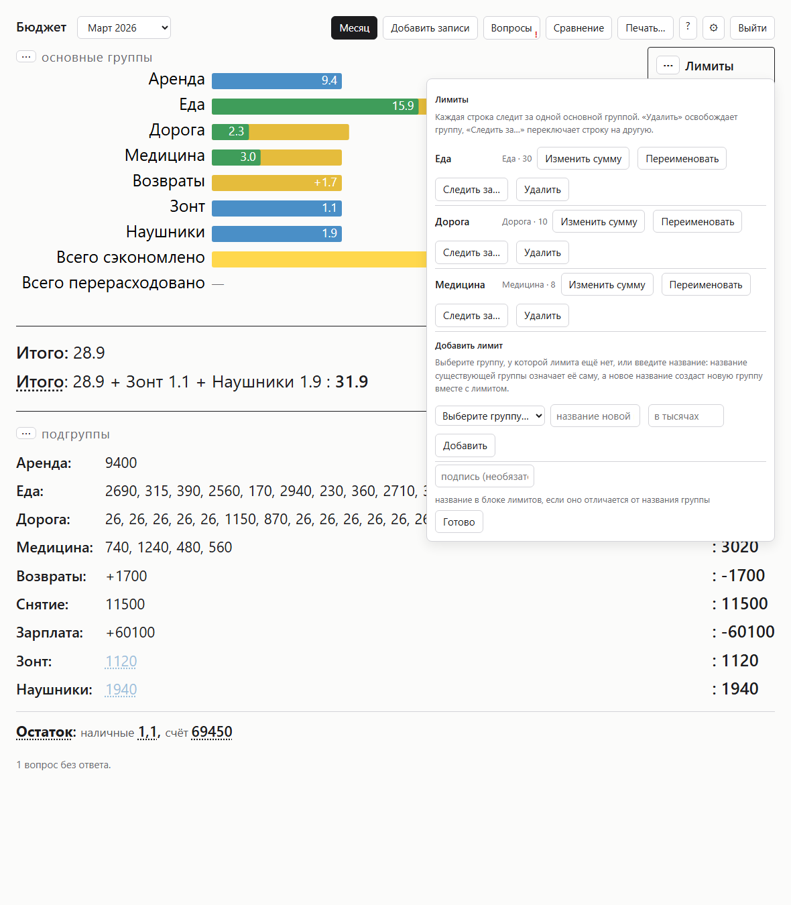

Каждая строка следит за одной основной группой.

- **Изменить сумму** задаёт число в тысячах. `30` означает 30 000.
- **Переименовать** меняет подпись в блоке, не переименовывая группу. Удобно,
  когда группа называется `Еда`, а этот бюджет вы про себя зовёте «Продукты».
- **Следить за…** переключает строку на другую группу.
- **Удалить** снимает лимит, и полоса группы становится синей.

**Добавить лимит** начинается с «Выберите группу…» и никогда не выбирает группу
за вас. Выберите группу или введите её название: если такая группа уже есть,
лимит встанет на неё, а новое название создаст новую группу вместе с лимитом.
Поле «подпись» только называет строку в блоке лимитов — группу оно не выбирает.

**Лимит никогда не спрашивает, к каким месяцам он относится.** Он не двигает ни
одной суммы, которую считает месяц, а только то, с чем месяц сравнивается,
поэтому редактор открывается сразу, и любое изменение в нём действует для всех
месяцев. Любой лимит можно убрать в любой момент.

Строки идут в том порядке, в каком вы их задали, — пусть это будет порядок, в
котором вам удобно читать.

**Лимиты необязательны.** Группа без лимита работает как обычно; вы просто
теряете для неё жёлтое и красное.

---

## Своя настройка с нуля

Вот как минут за десять перейти от групп, с которыми приложение начинает, к
своей жизни. Смысл такого порядка в том, что ничто не спрашивает и ничто не
пересчитывается: сначала вы перестраиваете группы и только потом начинаете
добавлять месяцы.

### 1. Уберите месяцы-примеры, если вы их вставляли

Если вы пробовали приложение на месяцах-примерах, уберите их, прежде чем
вставлять свои: выберите январь, самый ранний из них, откройте шестерёнку
(**⚙**) и в разделе **Начать заново** выберите
*Январь 2026 и все последующие месяцы*. Все ваши изменения групп при этом
останутся. *Всё — месяцы, ответы, группы и лимиты, с нуля* вернёт и группы
такими, какими приложение начинало. Ни то ни другое отменить нельзя.

### 2. Сначала решите, какие будут основные группы

Выпишите на бумаге заголовки, которые хотите видеть, когда смотрите на месяц, —
то, что вы считаете своими постоянными тратами. У большинства людей список
выглядит примерно так:

```
    Аренда        Питание       Разъезды      Здоровье
    Дом           Развлечения   Наряды        Хобби
```

**Правильного числа нет, и ограничивает вас не приложение.** Оно выдержит 200
основных групп и 500 подгрупп, до чего никто не дойдёт. Список стоит держать
коротким потому, что каждая лишняя группа — это ещё одно решение, которое
придётся принимать о каждой написанной строке, всегда. Добавить группу можно и
потом — а приложение само предложит это, как только строке будет некуда деться.

### 3. Сделайте группы своими

Переименуйте «Еду», «Дорогу» и «Медицину» в заголовки со своего листа, удалите
те, что вам не нужны, и добавьте остальные — в редакторах **⋯** (см.
[Группы](#группы)). Оставьте «Аренду», если вы её платите, и удалите, если нет.
До первого месяца ничто не спрашивает о месяцах и ничего нельзя потерять: у
удалённой группы ещё нет строк, которые пришлось бы куда-то возвращать.

### 4. Задайте им уровни

Спросите о каждой группе, которую добавляете: *бывает ли это каждый месяц, как
часть обычной жизни?* Если да, выберите **необходимая**. Если траты настоящие,
но нерегулярные — обувь, посылки, книги, — выберите **частая**. Уровень
**разовая** не трогайте: такие группы приложение заводит само, когда
встречается однократная трата.

### 5. Подгруппы — только там, где нужны подробности

В группе `Разъезды` можно держать отдельно такси и автобусы — так, как в примере
с подгруппой «Такси» в разделе [Группы](#группы). В группе `Дом`, вероятно,
нужна подгруппа на каждый счёт: скажем, `Отопление` и по одной для остальных. В
группе `Наряды`, вероятно, не нужно ничего.

Проверка: *захочу ли я когда-нибудь видеть это по отдельности?* Если нет — не
делите.

### 6. Поставьте лимиты на то, за чем хотите следить

Только на те группы, где число действительно изменит ваше поведение. Лимит на
группу, которой вы не управляете, — просто красная полоса, которая сообщает то,
что вы и так знали. Лимиты можно добавлять, менять и убирать в любой момент, и
ни о чём при этом приложение не спрашивает.

### 7. Теперь вставьте первый месяц

И ответьте на вопросы. Любая строка, слов которой приложение не знает,
становится вопросом, а ответ решает её судьбу только в этом месяце. Если один и
тот же магазин возвращается снова и снова, один раз научите приложение его
слову — см. [Как научить приложение слову](#как-научить-приложение-слову), — и
оно перестанет спрашивать.

**Название группы — не слово.** Если назвать группу `Дорога`, приложение не
выучит слово *дорога*: строка попадает в группу по правилам, по слову, которому
вы научили приложение, или по вашему ответу. Заглавные буквы роли не играют:
когда слово *дорога* выучено, туда пойдут и `ДОРОГА`, и `Дорога`. Вопрос о
строке, в которой названа группа, предложит эту группу первой — `260 дорога`
предложит «Дорогу», — но это всё равно вопрос: отнесёт строку только ваш ответ.

### 8. Как менять группы, когда месяцы уже есть

Когда месяцы уже есть, любой редактор, кроме редактора лимитов, прежде чем
открыться, спрашивает, к каким месяцам относится изменение.

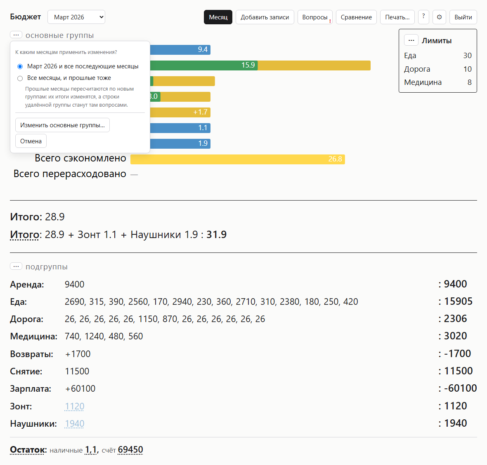

Карточка называет месяц, который у вас открыт, — например, для марта 2026 года:

- **Март 2026 и все последующие месяцы** — этот вариант уже выбран, и это
  обычный выбор. Месяцы, которые вы уже прочитали и напечатали, остаются с
  теми группами, по которым их читали; этот месяц и все после него получают
  новые. Жизнь изменилась в марте, а февраль должен остаться прежним.
- **Все месяцы, и прошлые тоже** — когда группа была неверной с самого начала.
  Карточка прямо говорит, чем это обернётся:
  *«Прошлые месяцы пересчитаются по новым группам: их итоги изменятся, а строки
  удалённой группы станут там вопросами.»*

Именно из-за этого предупреждения вопрос вообще задаётся. Без него удаление
группы тихо переписало бы все месяцы, которые вы уже смотрели.

Если изменение касается этого месяца и последующих, ваши изменения ставятся
**в очередь**: они перечисляются и применяются вместе, когда вы нажмёте
«Применить», — так наполовину законченная перестройка никогда не вступит в силу.

### Что происходит с суммами, пока вы всё перестраиваете

Ничего не пересчитывается неправильно, потому что ничего не хранится. Каждый
итог на странице вычисляется из ваших исходных записей каждый раз, когда вы на
него смотрите. Переименуйте группу, перенесите подгруппу, измените лимит —
обновите страницу, и суммы просто будут верны. Хранятся только ваши записи и
ваши ответы.

Вот тот же месяц после того, как переименовали три группы, изменили лимит и
добавили ещё одну группу:

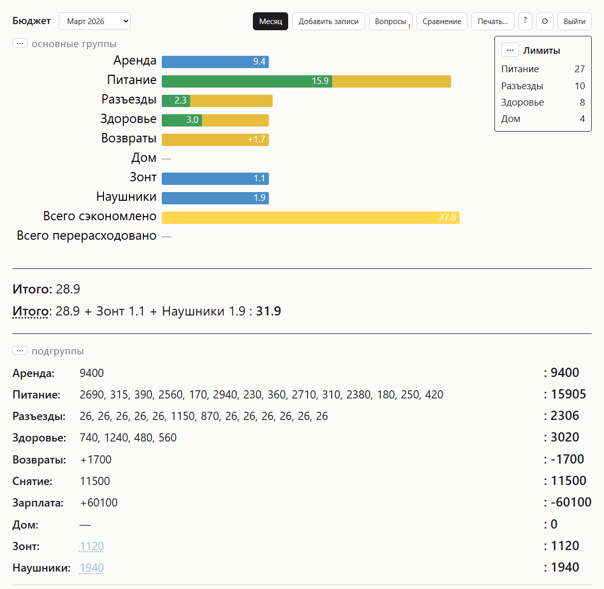

Те же деньги, те же суммы, другие слова.

---

## Строка остатка

Необязательная часть, и при первом чтении её легко пропустить. Она отвечает на
другой вопрос, чем всё остальное приложение: не *сколько я потратил*, а
**сколько у меня есть прямо сейчас**.

Если вы и так заканчиваете каждый день записью о том, сколько у вас есть,
приложение читает эту строку, ведёт её дальше по ходу месяца и подсказывает,
какими должны быть сегодняшние суммы.

Вы пишете одни числа в порядке, которого держитесь, а приложение подставляет
названия:

```
    вы пишете              Остаток: 2,9, 71830

    приложение показывает  Остаток: наличные 2,9, счёт 71830
```

Можно писать названия и самим, как в месяцах из примера.

Порядок ваш, и названия тоже. Приложение начинает с двух — тех, что на снимках
здесь:

| Сумма | Что это | Для чего |
| --- | --- | --- |
| **наличные** | наличные, которые вы действительно тратите, в тысячах | повседневная сумма наличных |
| **счёт** | остаток на счёте, с которого платит ваша карта, полной суммой | должен совпадать с банковским приложением; если не совпадает, пропущен день |

### Как ввести сумму самому

Каждую сумму строки остатка под месяцем можно нажать. Введите число — и оно
заменит то, что дают записи за этот месяц, с пометкой, что сумму задали вы, как
помечается сумма, заданная в итогах; сумма из записей видна при наведении.
**Вернуть сумму из записей** убирает вашу. Там, где у суммы нет значения, вместо
неё стоит маленькая кнопка **сумма…**.

Пока вы не вставили ни одного месяца, те же кнопки на пустой странице задают
начальные суммы — сколько у вас есть сейчас. Месяц, в записях которого нет
своей строки остатка, считает от них по своим дням, а следующий такой месяц — от
остатка предыдущего. Месяц, в который вы пишете строки остатка, читает их, как
всегда.

### Виды сумм и зачем они нужны

У каждой суммы есть **вид**. Вид — не украшение: по нему приложение доводит до
сегодняшнего дня наполовину записанный месяц, чтобы сегодняшняя строка была
верна, даже если в последний раз вы писали её во вторник.

| Вид | Что с ним делает приложение |
| --- | --- |
| **остаток на карте** | из него вычитается каждая оплата картой |
| **наличные на руках** | из него вычитается всё остальное |
| **кошелёк на неделю** | пополняется в выбранный вами день и тратится на выбранные вами группы |
| **перенесено** | не меняется, пока вы сами не напишете новую сумму |

Так, у суммы *наличные* вид «наличные на руках», а у суммы *счёт* — «остаток на
карте». Два других вида — для сумм, которые вы добавите сами: «кошелёк на
неделю» — для денег, которые пополняются сами, скажем, на еду на неделю, а
«перенесено» — для суммы, которую меняете только вы сами, например для
сбережений. Снятие наличных переводит деньги с карты в наличные, поэтому эти
две суммы ведутся вместе, а не порознь.

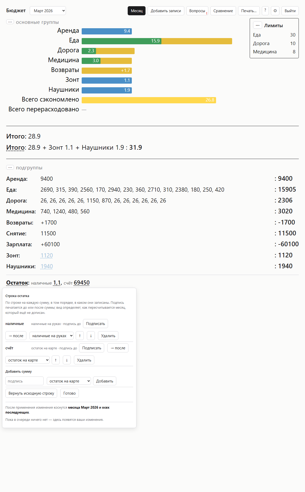

Чтобы открыть этот редактор, нажмите на слово **Остаток** внизу месяца. Там
можно переименовать каждую сумму, изменить её вид, поставить название до или
после числа, поменять суммы местами, добавить до двадцати или убрать те,
которые вы не ведёте. **Вернуть исходную строку** возвращает ту пару сумм, с
которой приложение начинает.

Переименуйте их в то, что вы на самом деле ведёте. Если вы вообще не пишете
такую строку, пропустите этот раздел — больше ничто от неё не зависит.

---

## Как исправить сумму

Любую сумму на странице месяца можно нажать и перенести — не только ту, о
которой вас спрашивали.

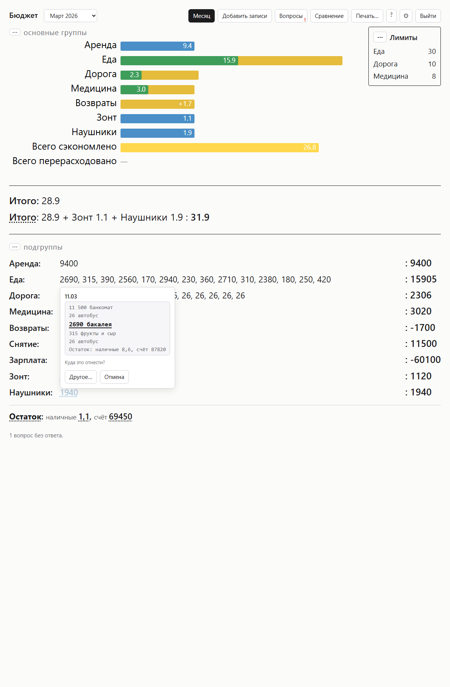

Всплывающее окно показывает день, когда записана строка этой суммы, так же, как
вопрос: дату, строки этого дня так, как вы их написали, строку самой суммы
жирным, в окне, которое прокручивается, — и предлагает, куда её отнести.
Одинаковых сумм в месяце бывает много, и по дню понятно, какое из этих 26 — это.
Если сумма сложилась из нескольких строк, например поездка вместе с проездом,
окно показывает каждый день, откуда они пришли. Если вы уже переносили её,
**Вернуть на место** отменяет ваш
перенос, и снова решает ваш ответ, если вы его давали, а если нет — правила.

**Ваше решение всегда важнее.** Сумма, по которой вы ответили или которую
перенесли, остаётся ровно там, куда вы её поставили, — что бы ни говорили о ней
правила, в том числе правила, добавленные в приложение после вашего решения, и
в том числе после восстановления из резервной копии. Правила размещают только
те суммы, о которых вы никогда не решали. Поэтому резервная копия,
восстановленная в более новой версии приложения, показывает тот месяц, который
вы сохранили, а не новое его прочтение.

У этого есть и обратная сторона: старый ответ важнее и правила, о котором вы
попросили позже. Если сумма стоит не там, где вам теперь нужно, нажмите на неё
и выберите снова — только так она и перемещается.

У сумм есть пометка о том, как они попали на своё место: отнесённая вашим
ответом, перенесённая вами и размещённая правилами выглядят немного по-разному.
Наведите на сумму указатель, и подсказка скажет, какая это.

**Старые месяцы закрываются сами.** Через три месяца после окончания месяц
становится доступным только для чтения, чтобы случайное нажатие не изменило
сумму, по которой вы уже что-то сделали. Если исправить его действительно
нужно, полоса вверху месяца открывает его и прямо предупреждает, что вы,
возможно, меняете то, что уже напечатали.

---

## Сравнение месяцев и печать

**Сравнение** показывает месяцы рядом в одной таблице: каждую группу, каждый
месяц и среднее. Отметьте нужные месяцы — сначала отмечены два последних, и
обычно вопрос как раз о них.

**Среднее** считает среднее ровно по отмеченным месяцам. Кнопки лет отмечают
целый год, а незаконченный год кончается месяцем, который ещё пишется, и тот
тянет среднее вниз; снимите отметку с этого месяца и нажмите *Среднее*, чтобы
увидеть год таким, какой он есть. *Печать…* затем печатает то, что вы построили
последним, вместе со средним.

**Печать…** сохраняет месяц или весь год файлом Word или текстовым файлом,
размеченным для бумаги.

---

## Меню настроек

Кнопка **⚙** справа вверху хранит то, что задаётся один раз и редко меняется:

- **Язык** — English или Русский; см. [Язык](#язык) ниже.
- **Цвета полос** и **Размеры текста** — каждый цвет диаграммы и каждый размер
  шрифта; всё меняется на лету. Они хранятся в этом браузере, а не в ваших
  данных; файл резервной копии тоже их несёт, так что восстановление
  возвращает и их.
- **Учётная запись** — *Контрольные вопросы* открывает страницу, где их задают
  или меняют (см. [Ваша учётная запись](#ваша-учётная-запись)). Сама справка —
  это **?** рядом с шестерёнкой: она открывает это руководство в новой вкладке.
- **Резервная копия** — см. [Резервные копии](#резервные-копии).
- **Начать заново** — стирает этот месяц, этот месяц и последующие или всё.
  Спрашивает дважды, и отменить это нельзя. *Всё* возвращает группы, с которыми
  приложение начинает.

Приложение также **открывается там, где вы остановились**: в том разделе, где
вы были, — кроме *Добавить записи*: это действие, а не место, поэтому
приложение всегда встречает вас вашими суммами, — и всегда на самом новом
месяце. Раздел запоминает этот браузер.

### Язык

**Язык** — первый пункт меню настроек: *English* или *Русский*. Приложение
запускается на английском; чтобы перейти на русский, выберите «Русский» в меню
настроек. Сразу по-русски копия начинает работу, только если «Русский» выбрали
ещё до создания учётной записи.

- **Что переключается:** всё, что пишет само приложение, — меню, кнопки и
  сообщения, вопросы, которые оно задаёт, сравнение и файлы для печати, а также
  эта справка: **?** открывает её на выбранном языке.
- **Что не переключается никогда:** всё ваше. Названия ваших групп и лимитов,
  названия в строке остатка, выученные слова и ваши записи остаются точно
  такими, как есть.
- **Группы меняются только в нетронутом приложении.** Приложение начинает с
  одной из двух семей: это те же группы и лимиты, названные по-английски или
  по-русски — «Аренда», «Еда», «Дорога», «Медицина», — и каждая читает записи
  на своих словах. Пока ничего не добавлено, не отвечено, не перенесено, не
  изменено и не выучено, смена языка заодно ставит на место семью на этом
  языке. После этого переключение меняет только слова на экране.
  **Начать заново** → *Всё* возвращает семью на выбранном языке.
- **У записей свои слова.** Слова, по которым приложение читает ваши записи, —
  `Остаток:`, `картой`, `не считать` и остальные — принадлежат семье, а не
  экрану. Английская семья читает английские слова, на каком бы языке ни был
  экран; русская — русские, а заодно и английские. Список — в разделе
  [Слова записей](#слова-записей). Распознавание скриншотов тоже следует за
  семьёй: у русской оно читает и кириллицу, и латиницу.
- **До входа** страницы входа предлагают **English · Русский**, и если создать
  учётную запись на русской странице, приложение запустится на русском, с
  русской семьёй.
- **Язык сохраняется в файле.** Этот браузер помнит ваш выбор, а
  **Скачать конфигурацию** записывает его в файл, так что восстановление
  возвращает язык вместе со всем остальным.

---

## Резервные копии

Шестерёнка (**⚙**) → **Скачать конфигурацию** сохраняет всё — месяцы, ответы,
группы, лимиты, цвета, язык — одним файлом. **Восстановить из файла…** читает
его обратно.

В файле есть и ваши правила — один файл хранит всё, — поэтому приложение на
телефоне восстанавливает его так, что каждый месяц читается точно так же, как
здесь. Файл, сохранённый раньше, без правил, телефон не принимает: сохраните
новый. При восстановлении здесь приложение оставляет свои правила; если файл
сделан с другими, сообщение после восстановления об этом скажет. Исключение —
файл, сделанный с другой семьёй, которая есть в этой копии: тогда приложение
сначала ставит эту семью на место, и месяцы читаются так же, как там, где файл
был сделан. В файле все ваши суммы и ваши правила — храните его там, где его
видите только вы.

Две полезные привычки:

- Делайте копию перед любой большой перестройкой групп.
- Время от времени делайте её просто так и храните не на этом компьютере.

Вся папка тоже переносима: закройте приложение, заархивируйте папку, и оно
заработает там, где вы её распакуете, — с вашими данными и вашим входом внутри.
Файл резервной копии — для случая, когда нужен снимок, а не всё целиком.

---

## Если что-то выглядит не так

**Сумма не в той группе.** Нажмите на неё и перенесите. Если и в следующих
месяцах такая строка попадает не туда, научите приложение слову, которое вы
пишете, — см. [Как научить приложение слову](#как-научить-приложение-слову).

**Итог сдвинулся на 0.1 без причины.** Каждая основная группа округляется до
одного знака после точки и только потом складывается, поэтому перенос одной
строки между группами может сдвинуть итог на десятую. Так сделано намеренно:
итог — это сумма тех же округлённых чисел, что видны на полосах.

**Месяц пропал.** Вероятно, у него нет первой строки с доходом, и ничто не
подсказало приложению, где он начинается. Вставьте записи снова, с начала
заметки.

**День появился дважды.** Так быть не должно — более полная копия заменяет более
короткую. Если всё же появился, значит, у двух копий записаны разные даты.

**Всё превратилось в вопросы.** Обычно это первый месяц, и всё быстро
налаживается. Приложение нарочно начинает с немногих слов, поэтому в ваших
записях будет много незнакомых: ответьте на каждый вопрос один раз, а словам,
которые повторяются из месяца в месяц, научите приложение — см.
[Как научить приложение слову](#как-научить-приложение-слову).

**Страница говорит, что месяц закрыт.** Ему больше трёх месяцев. Перейдите к
нему в разделе «Месяц» и нажмите *Открыть этот месяц*.

**Вы забыли пароль.** Нажмите *Забыли пароль?* на странице входа и ответьте на
контрольные вопросы. Если вы их не задали или не можете ответить, удалите
`data/users.json`, и приложение предложит создать учётную запись заново; ваши
записи хранятся в `data/store.json` и не пострадают. См.
[Ваша учётная запись](#ваша-учётная-запись).

---

Как установить, перенести и запустить приложение и что делать, если оно не
запускается, — см. [README.ru.md](README.ru.md).
